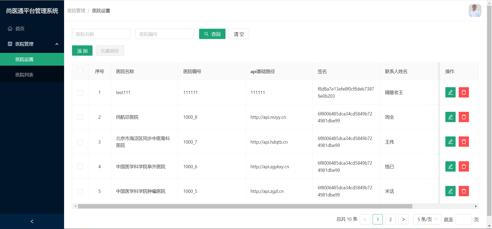
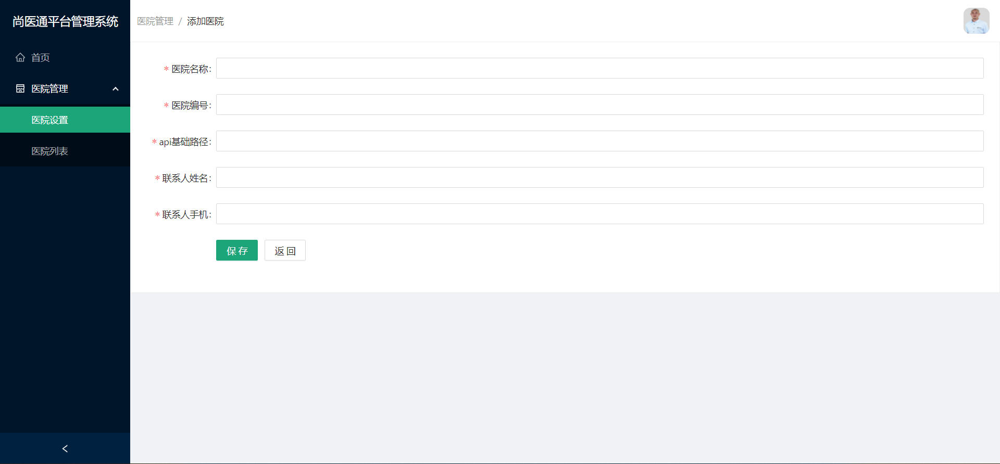
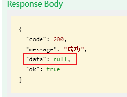

# 医院管理 - 医院设置

- 医院设置



- 添加或更新医院



## 需求介绍

1. 医院设置静态组件
2. 医院列表数据分页展示
3. 根据医院名称和医院编号查询医院列表
4. 清空搜索条件
5. 添加医院
6. 修改医院
7. 删除医院
8. 批量删除医院

## 搭建静态组件

开发流程简述：

1. 先从 `antd` 官网复制基本组件代码，再查看组件上的属性，需要哪个就将对应代码复制过来(页面不能报错，有基本显示效果)。
2. 浏览整个组件，查看组件和组件上面的属性是否明白。
3. 最后对部分内容进行修改。


### 搭建表单

> - 利用antd的组件快速搭建界面
> - 定义并使用全局通用样式

- src\pages\hospital\hospitalSet\index.tsx

```tsx
import { SearchOutlined } from "@ant-design/icons";
import { Button, Card, Form, Input } from "antd";

/* 
医院设置路由组件
*/
export default function HospitalSet() {
  return (
    <Card>
      {/* 
        Form 表单
          layout属性: 布局方式
            inline: 所有的标题和输入框都在一行
            horizontal: 某个标题和输入框在一行
            vertical: 所有标题和输入框者垂直排列
          Form.Item 表单项
            label属性: 标题
            Input 输入框
            Button 按钮
              type属性: 类型 primary代表基本按钮
              icon属性: 图标
      */}
      <Form layout="horizontal">
        <Form.Item>
          <Input placeholder="医院名称" />
        </Form.Item>

        <Form.Item>
          <Input placeholder="医院编号" />
        </Form.Item>

        <Form.Item>
          <Button type="primary" icon={<SearchOutlined />}>
            查询
          </Button>
          <Button className="ml">清空</Button>
        </Form.Item>
      </Form>
    </Card>
  );
}

```

- src\styles\index.css

```less
...
...

/* 全局样式 */
.ml {
  margin-left: 10px;
}
```


### 搭建操作按钮

> 修改当前组件特定样式: 为当前组件单独定义样式文件

- src\pages\hospital\hospitalSet\index.less

  ```less
  .mtb {
    margin-top: 20px;
    margin-bottom: 20px;
  }
  ```


- src\pages\hospital\hospitalSet\index.tsx

```tsx
import './index.less'

...
...

<div className="mtb">
  <Button type="primary">添加</Button>
  <Button disabled className="ml">批量删除</Button>
</div>

...
...
```


### 搭建表格

```tsx
...
...

/* 
  columns: 表格所有列的描述信息对象的数组
    title: 标题
    dataIndex: 要显示数据的属性名
    render: 回调函数, 用于返回要显示的界面 (非属性值文本)
      如果指定了dataIndex: render(value, row, index)  
      			参数为 当前行数据对象的dataIndex属性值/当前行数据对象/当前行下标
      如果没有指定dataIndex: render: (value, row, index) 
      			参数为 当前行数据对象/当前行数据对象/当前行下标
    width: 宽度
    fixed: 固定当前列
*/
const columns: ColumnsType<any> = [
    {
      title: '序号',
      render (value, row, index) {
        return index + 1
      }
    },

    {
      title: '医院名称',
      dataIndex: 'hosname',
      // render(value, row, index) {
      //   console.log('render', value, row, index)
      //   return <a>{value}</a>
      // }
    },
    {
      title: '医院编号',
      dataIndex: 'hoscode',
    },
    {
      title: 'api基础路径',
      dataIndex: 'apiUrl',
    },
    {
      title: '签名',
      dataIndex: 'signKey',
    },
    {
      title: '联系人姓名',
      dataIndex: 'contactsName',
    },
    {
      title: '联系人手机',
      dataIndex: 'contactsPhone',
    },
    {
      title: '操作',
      render: (/* value, row, index */) => {
        // console.log('render', value, row, index)
        return (
        
          <>
            <Button type="primary" size="small" icon={<EditOutlined/>}></Button>
            <Button type="primary" danger size="small" icon={<DeleteOutlined/>} className='ml'></Button>
          </>
        )
      },
      width: 100, // 宽度
      fixed: 'right' // 固定当前列在右侧
    },
  ];
  
  const data = [
    {
      "id": 90098,
      "createTime": "2022-07-03 00:54:16",
      "updateTime": "2022-07-03 00:54:16",
      "isDeleted": 0,
      "param": {},
      "hosname": "尚硅谷A",
      "hoscode": "111456",
      "apiUrl": "xxx",
      "signKey": "bbc709d69f69c360f9184ccc7b659953",
      "contactsName": "feigee",
      "contactsPhone": "138139999",
      "status": 1
    },
    {
      "id": 90097,
      "createTime": "2022-07-03 00:53:46",
      "updateTime": "2022-07-03 00:53:46",
      "isDeleted": 0,
      "param": {},
      "hosname": "尚硅谷A",
      "hoscode": "111333",
      "apiUrl": "xxx",
      "signKey": "5313fd88a61e651abe417b7740e3c6b2",
      "contactsName": "feigee",
      "contactsPhone": "138139999",
      "status": 1
    }
  ]
  
  ...
  ...
  
{/* 
  Table 表格
  	bordered 带边框线   不指定属性值, 代表属性值是true
    columns 所有列描述的数组
    dataSource 列表数据数组
    rowKey 列表项的key用哪个属性(需要是唯一的)  一般指定为id
    scroll 指定宽度超过指定的值, 形成滚动条   一般与columns中的fixed配合使用
*/}
<Table 
  bordered
  columns={columns} 
  dataSource={data} 
  rowKey="id"
  scroll={{x: 1300}}
/>


```

### 搭建分页器

```tsx

...
...

// 定义分页相关的state数据
const [current, setCurrent] = useState(1)
const [total, setTotal] = useState(0)
const [pageSize, setPageSize] = useState(5)

...
...

{/* 
  Table 表格
    bordered 带边框线   不指定属性值, 代表属性值是true
    columns 所有列描述的数组
    dataSource 列表数据数组
    rowKey 列表项的key用哪个属性  一般指定为id
    scroll 指定宽度超过指定的值, 形成滚动条   一般与columns中的fixed配合使用
    pagination 分页器配置对象
      current 当前页码
      pageSize 每页数量
      total 总数量
      showSizeChanger 是否显示修改每页数量的下拉框
      pageSizeOptions 指定可选每页数量的数组
      showQuickJumper 是否显示快速跳转页码的输入框
      showTotal 用于返回显示总条数界面的回调函数
*/}
<Table 
  
  ...
  ...
  
  pagination={{
    current,
    total,
    pageSize,
    showSizeChanger: true,
    pageSizeOptions: [5, 10, 15],
    showQuickJumper: true,
    showTotal: total => `总共 ${total} 条`
  }}
/>
```

## 动态显示分页列表

### 查看 API 文档

> [接口文档地址](http://139.198.34.216:8201/swagger-ui.html)

确定请求相关信息（请求方式、请求地址、请求参数和响应返回值数据结构）


从图中可知：

- 请求方式：GET
- 请求地址：/admin/hosp/hospitalSet/{page}/{limit}
- 请求参数有四个：
  - page （params 参数）
  - limit（params 参数）
  - hosname（query 参数）
  - hoscode（query 参数）

点击 `Try it out!` 按钮, 可得响应数据结构：

```json
// 只保留需要使用的数据
{
  // 医院列表
  "records": [
    {
      "id": 3,
      "hosname": "民航总医院", // 医院名称
      "hoscode": "1000_8", // 医院编号
      "apiUrl": "http://api.mzyy.cn", // API基础路径
      "signKey": "6f8006485dca34cd5849b724981dbe99", // 签名
      "contactsName": "周全", // 联系人姓名
      "contactsPhone": "15745634567", // 联系人手机
    }
  ],
  // 总数
  "total": 9
}
```


### 定义请求函数

- src/api/hospital/hospitalSet.ts

```ts
import { request } from "@/utils/http";

// 获取医院列表
export const reqGetHospitalSetList = ({ page, limit, hosname, hoscode }) => {
  return request.get(`/admin/hosp/hospitalSet/${page}/${limit}`, {
    params: {
      hosname,
      hoscode,
    },
  });
};
```

### 定义数据类型

此时还没有定义数据类型，ts 是报错状态。

接下来我们定义函数数据类型:

- src/api/hospital/model/hospitalSetTypes.ts

```ts
// 获取医院设置列表的参数类型
export interface ReqHospitalSetListParams {
  page: number; // 页码
  limit: number; // 每页数量
  hosname: string; // 医院名称
  hoscode: string; // 医院编号
}

// 医院设置的医院类型
export interface HospitalSetItem {
  id: number;
  hosname: string; // 医院名称
  hoscode: string; // 医院编号
  apiUrl: string; // API基础路径
  signKey: string; // 签名
  contactsName: string; // 联系人姓名
  contactsPhone: string; // 联系人手机
}

// 医院设置的医院数组类型
export type HospitalSetList = HospitalSetItem[];

// 获取医院设置列表的响应数据类型
export interface ReqHospitalSetListResponse {
  records: HospitalSetList;
  total: number;
}
```

最后给封装的接口函数加上类型:

- src/api/hospital/hospitalSet.ts

```ts
import { request } from "@/utils/http";
import type { 
  ReqHospitalSetListParams, 
  ReqHospitalSetListResponse 
} from "./model/hospitalSetTypes";

// 请求获取医院设置列表
export const reqGetHospitalSetList = ({page, limit, hosname,hoscode}: ReqHospitalSetListParams) => {
  return request.get<any, ReqHospitalSetListResponse>(
    `/admin/hosp/hospitalSet/${page}/${limit}`, 
    {
      params: {
        hosname,
        hoscode
      }
    }
  )
}
```

### 动态显示分页列表

- src/pages/hospital/hospitalSet/index.tsx

```tsx

  ...
  ...
  
  const [hospitalList, setHospitalList] = useState<HospitalSetList>([])

  // 异步请求获取医院列表显示
  const getHospitalList = async (page=current, limit=pageSize) => {
    // console.log(page, limit)
    
    // 请求获取分页数据
    const result = await reqGetHospitalSetList({page, limit})
    // 成功后, 更新相关数据, 显示分页列表
    const {total, records} = result
    setTotal(total)
    setHospitalList(records)
    setCurrent(page)
    setPageSize(limit)
  }

  // 初始获取分页列表显示
  useEffect(() => {
    getHospitalList()
  }, [])

 
  const columns: ColumnsType<HospitalSetItem> = [
    ...
    ...
  ];
  
  ...
  ...

  <Table 
        ...
    		...
    		dataSource={hospitalList} 
        pagination={{
          ...
          ...
          onChange: getHospitalList // 当页码或每页数量发生改变时调用
        }}
        
  />

```


### 添加 Loading 效果

- src/pages/hospital/hospitalSet/index.tsx

```tsx
...
...

// 是否显示Loading的标识
const [loading, setLoading] = useState(false)

/**
   * 获取指定页码与每页数量的医院列表显示
   * @param page 页码
   * @param limit 每页数量
   */
const getHospitalList = async (page=current, limit=pageSize) => {
  // console.log(page, limit)
  // 请求前显示loading
  setLoading(true)
  // 请求获取分页数据
  const {total, records} = await reqGetHospitalList({page,limit})
  // 请求成功后隐藏loading
  setLoading(false)
   // 更新页码与每页数量
  setCurrent(page)
  setPageSize(limit)
  // 更新总数量和当前页列表
  setTotal(total)
  setHostpitalList(records)
}

<Table 
  loading={loading}
  ...
>
```


## 搜索医院列表

### 表单数据收集与重置

- src/pages/hospital/hospitalSet/index.tsx

```tsx
...
...

/* 
  创建form对象, 用于管理(收集/读取/重置)表单数据的对象
    将form对象传递给Form: <Form form={form}>
    每个Item都指定name属性来收集表单项输入数据: <Form.Item name="hosname"> 指定保存数据的属性名
    通过form对象读取或重置表单数据
      form.getFieldsValue(): 返回包含所有表单数据的对象---{hosname: xxx, hoscode: yyy}
      form.resetFields(): 清除表单输入
*/
const [form] = Form.useForm()

/* 
  点击提交按钮的回调
  */
const onFinish = () => {
  console.log(values) // {hosname: 'xxx', hoscode: 'yyy'}
  console.log(form.getFieldsValue()) // {hosname: 'xxx', hoscode: 'yyy'}
};

/* 
  点击重置的回调
  */
const onReset = () => {
  form.resetFields()
};


...
...


<Form form={form} onFinish={onFinish} layout="inline">
    <Form.Item name='hosname'>
      <Input placeholder="医院名称" />
    </Form.Item>
    <Form.Item name='hoscode'>
      <Input placeholder="医院编号" />
    </Form.Item>
    <Form.Item>
      <Button htmlType="submit" type="primary" icon={<SearchOutlined />}>
        查询
      </Button>
      <Button htmlType="button" className="ml" onClick={onReset}>清空</Button>
    </Form.Item>
  </Form>
```

### 完成搜索与清空

- src/pages/hospital/hospitalSet/index.tsx

```tsx
...
...

/* 
创建form对象, 用于收集/读取/重置表单数据
  将form对象传递给Form: <Form form={form}>
  每个Item都指定name属性来收集表单项输入数据: <Form.Item name="hosname"> 指定保存数据的属性名
  通过form对象读取或重置表单数据
    form.getFieldsValue(): 返回包含所有表单数据的对象---{hosname: xxx, hoscode: yyy}
    form.resetFields(): 清除表单输入
*/
const [form] = Form.useForm()

/* 
点击提交按钮的回调
*/
const onFinish = () => {
  // 获取列表显示
  getHospitalList()
};

/* 
点击重置的回调
*/
const onReset = () => {
  // 重置表单输入
  form.resetFields()
  // 重新获取列表
  getHospitalList()
};

/**
 * 获取指定页码与每页数量的医院列表显示
 * @param page 
 * @param limit 
 */
const getHospitalList = async (page=current, limit=pageSize) => {
  // console.log(page, limit)
  // 更新页码与每页数量
  setCurrent(page)
  setPageSize(limit)
  // 显示loading
  setLoading(true)

  // 得到表单输入的数据(收集在form对象中了)
  const {hosname, hoscode} = form.getFieldsValue()
  // 请求获取分页数据
  const {total, records} = await reqGetHospitalList({page,limit, hosname, hoscode})
  // 隐藏loading
  setLoading(false)
  // 更新总数量和当前页列表
  setTotal(total)
  setHostpitalList(records)
}


...
...

```


## 添加医院

### 新建路由组件

- src/pages/hospital/hospitalSet/components/AddOrUpdateHospital.tsx

```tsx
/* 
添加或更新医院的路由组件
*/
export default function AddOrUpdateHospital() {
  return (
    <div>AddOrUpdateHospital</div>
  )
}
```

### 进行路由配置

```ts
...
...


const AddOrUpdateHospital = lazy(
  () => import("@pages/hospital/hospitalSet/components/AddOrUpdateHospital")
);


...
...


{
  path: '/syt/hospital/hospitalSet',
  meta: {title: '医院设置'},
  element: load(HospitalSet)
},
{
  path: "/syt/hospital/hospitalSet/add",
  meta: { title: "添加医院" },
  element: load(AddOrUpdateHospital),
  hidden: true, // 不会生成左侧菜单
},


```

### 点击跳转路由

```tsx
...
...

// 得到路由导航/跳转函数
const navigate = useNavigate()
// 跳转到添加界面
const goAddHospital = () => {
  // navigate('/syt/hospital/hospitalSet/add', {replace: true}) // replace模式
  // navigate('/syt/hospital/hospitalSet/add') // push模式
  navigate('add') // 可以简写路径参数
}

...
...


<Button type="primary" onClick={goAddHospital}>添加</Button>

```

### 搭建静态组件

- src/pages/hospital/hospitalSet/components/AddOrUpdateHospital.tsx

```tsx
/* 
添加或更新医院的路由组件
*/
export default function AddOrUpdateHospital() {

  const [form] = useForm()
  const onFinish = (values: any) => {
    console.log(values)
  }

  return (
    <Card>
      {/* 
        labelCol: 左侧标题的宽度
        wrapperCol: 右侧部分的宽度
          offset: 指定向右偏移的宽度
        内部使用了栅格样式, 整个宽度分为了24份
      */}
      <Form 
        form={form}
        labelCol={{ span: 2 }}
        wrapperCol={{ span: 22 }}
        onFinish={onFinish}>
        <Form.Item name='hosname' label="医院名称">
          <Input placeholder="请输入医院名称"></Input>
        </Form.Item>
        <Form.Item name='hoscode' label="医院编号">
          <Input placeholder="请输入医院编号"></Input>
        </Form.Item>
        <Form.Item name='apiUrl' label="api基础路径">
          <Input placeholder="请输入api基础路径"></Input>
        </Form.Item>
        <Form.Item name='contactsName' label="联系人姓名">
          <Input placeholder="请输入联系人姓名"></Input>
        </Form.Item>
        <Form.Item name='contactsPhone' label="联系人手机">
          <Input placeholder="请输入联系人手机"></Input>
        </Form.Item>
        <Form.Item wrapperCol={{offset: 2}}>
          <Button type="primary" htmlType="submit">保存</Button>
          <Button className="ml">返回</Button>
        </Form.Item>
      </Form>
    </Card>
  )
}
```


### 定义表单校验规则

> 内部使用的是另一个表单校验的工具库: `async-validator`
>
> 可以使用内置了一些校验规则
>
> 也可以自定义校验

```tsx
<Form 
  form={form}
  labelCol={{ span: 3 }}
  wrapperCol={{ span: 21 }}
  onFinish={onFinish}>
  <Form.Item 
    name='hosname' 
    label="医院名称" 
    rules={[
      {required: true, message: '请输入医院名称'}
    ]}
  >
    <Input placeholder="请输入医院名称"></Input>
  </Form.Item>
  <Form.Item 
    name='hoscode' 
    label="医院编号"
    rules={[
      {required: true, message: '请输入医院编号'}
    ]}
  >
    <Input placeholder="请输入医院编号"></Input>
  </Form.Item>
  <Form.Item 
    name='apiUrl' 
    label="api基础路径"
    rules={[
      {required: true, message: '请输入api基础路径'}
    ]}
  >
    <Input placeholder="请输入api基础路径"></Input>
  </Form.Item>
  <Form.Item 
    name='contactsName' 
    label="联系人姓名"
    rules={[
      {required: true, message: '请输入联系人姓名'}
    ]}
  >
    <Input placeholder="请输入联系人姓名"></Input>
  </Form.Item>
  <Form.Item 
    name='contactsPhone' 
    label="联系人手机"
    rules={[
      // 使用内置校验规则校验
      {required: true, message: '请输入联系人手机'},
      {pattern: /^1[3-9][0-9]{9}$/, message: '请输入合法的手机号'},
    ]}
  >
    <Input placeholder="请输入联系人手机"></Input>
  </Form.Item>
  <Form.Item wrapperCol={{offset: 3}}>
    <Button type="primary" htmlType="submit">保存</Button>
    <Button className="ml">返回</Button>
  </Form.Item>
</Form>
```

### 定义接口函数&类型

- 接口函数类型
- src/api/hospital/model/hospitalSetTypes.ts

```ts
...
...

// 添加医院参数类型
export interface ReqAddHospitalParams {
  apiUrl: string;
  contactsName: string;
  contactsPhone: string;
  hoscode: string;
  hosname: string;
}
```


- 接口函数
- src/api/hospital/hospitalSet.ts

```ts
...
...

// 添加医院
export const reqAddHospital = (hospital: ReqAddHospitalParams) => {
  // 添加/更新/删除请求接口返回的响应数据的data属性为null
  return request.post<any, null>(`/admin/hosp/hospitalSet/save`, hospital);
};
```




### 添加医院和返回

- 包含3个功能
  - 请求添加医院
  - 请求中的loading效果
  - 返回

- src/pages/hospital/hospitalSet/components/AddOrUpdateHospital.tsx

```tsx
...
...

// loading标识
const [loading, setLoading] = useState(false)

// 创建路由导航函数
const navigate = useNavigate()

/* 
  表单校验通过后调用的回调
  */
const onFinish = async (values: ReqAddHospitalParams) => {
  try {
    setLoading(true)
    // 请求添加
    await reqAddHospital(values);
    setLoading(false)
    // 提示成功
    message.success("添加医院成功");
    // 跳转到医院设置路由
    navigate("/syt/hospital/hospitalSet", {replace: true});
  } catch (error) {
    setLoading(false)
  }
};

  ...
  ...

<Form.Item wrapperCol={{offset: 2}}>
  <Button type="primary" htmlType="submit" loading={loading}>
    保存
  </Button>
  <Button 
    className="ml" 
    onClick={() => navigate("/syt/hospital/hospitalSet", {replace: true})}>返回</Button>
</Form.Item>
```


## 修改医院

### 配置路由

> 可以将同一个组件注册成多个路由, 也就是有多个不同的路由路径
>
> 这种方式经常用于添加和修改功能

- src/routes/index.tsx

```tsx
{
  path: "/syt/hospital/hospitalSet/edit/:id",
  meta: { title: "修改医院" },
  element: load(AddOrUpdateHospital), // 使用同一个组件
  hidden: true,
},
```


### 点击跳转路由

> 给修改按钮添加hover的文本提示效果
>
> 跳转路由时要携带path/params参数

- src/pages/hospital/hospitalSet/index.tsx

```tsx
import { Tooltip } from "antd";

...
...

<Tooltip placement="top" title="修改医院">
  <Button type="primary" size="middle" icon={<EditOutlined/>} 
    onClick={goUpdateHispital(row.id)}/>
</Tooltip>

...
...

/* 
跳转去修改界面
*/
const goUpdateHispital = (id: number) => {
  return () => {
    navigate(`/syt/hospital/hospitalSet/edit/${id}`);
  };
}

```

### 定义接口函数&类型

此时我们需要根据 id 获取到要修改的医院数据，最后进行修改，一共两个接口。

- 数据类型接口
- src/api/hospital/model/hospitalSetTypes.ts

```ts
// 定义类型时能复用一定要复用！
// 修改医院参数类型
export interface ReqUpdateHospitalParams extends ReqAddHospitalParams {
  id: number;
}
```


- 接口函数
- src/api/hospital/hospitalSet.ts

```ts
...
...

// 获取某个医院数据
export const reqGetHospital = (id: number) => {
  return request.get<any, HospitalSetItem>(`/admin/hosp/hospitalSet/get/${id}`);
};

// 修改医院
export const reqUpdateHospital = (hospital: ReqUpdateHospitalParams) => {
  return request.put<any, null>(`/admin/hosp/hospitalSet/update`, hospital);
};
```

### 显示要修改的数据

- src/pages/hospital/hospitalSet/components/AddOrUpdateHospital.tsx

```tsx
...
...

// 得到跳转路由是可能会携带的医院id (添加没有, 更新有)
const {id} = useParams()
// 初始化请求获取对应的医院信息, 显示到form中
useEffect(() => {
  async function getHospital() {
    // 只有有id时, 才会去获取医院数据显示
    if (id) {
      // 根据id, 请求得到对应的医院数据对象
      const hospital = await reqGetHospital(+id)
      // 将数据对象交给表单显示
      form.setFieldsValue(hospital)
    }
  }

  getHospital()
}, [])

```

### 修改医院

```tsx
...
...

/* 
表单校验通过后调用的回调
*/
const onFinish = async (values: ReqAddHospitalParams) => {
  try {
    setLoading(true)

    if (id) { // 更新
      await reqUpdateHospital({
        ...values,
        id: +id, // params中的参数类型是string，要将其转化为number
      });
    } else { // 添加
      await reqAddHospital(values);
    }

    setLoading(false)
    // 提示成功
    message.success(`${id ? "更新" : "添加"}医院成功`);
    // 跳转到医院设置路由
    navigate("/syt/hospital/hospitalSet", {replace: true});
  } catch (error) {
    setLoading(false)
  }
};
```

## 删除单个医院

### 定义接口函数

- src/api/hospital/hospitalSet.ts

```ts
// 删除医院
export const reqRemoveHospital = (id: number) => {
  return request.delete<any, null>(`/admin/hosp/hospitalSet/remove/${id}`);
};
```

### 删除医院

- src/pages/hospital/hospitalSet/index.tsx

```tsx
import { reqRemoveHospital } from "@/api/hospital/hospitalSet";

...
...

<Tooltip placement="top" title="删除医院">
  <Button onClick={() => removeHospital(row.id)} type="primary" danger size="middle" icon={<DeleteOutlined/>} className="ml"/>
</Tooltip>

...
...

/* 
删除指定id的医院
*/
const removeHospital = async (id: number) => {
  // 发送请求，只会删除服务器数据，客户端数据没变
  await reqRemoveHospital(id);
  message.success("删除医院成功");
  // 重新获取最新医院列表即可
  getHospitalList(current, pageSize);
}

```

## 批量删除医院

### 显示复选框和按钮禁用效果

- src/pages/hospital/hospitalSet/index.tsx

```tsx
import {Key} from 'react'

...
...

// 所有选择的医院的id的数组
const [selectedIds, setSelectedIds] = useState<Key[]>([])

...
...

{/* 如果没有选择一个医院, 禁用按钮 */}
<Button className="ml" type="primary" danger disabled={selectedIds.length===0}>批量删除</Button>

...
...

<Table 
  
  ...
  ...
  
  rowSelection={{
    type: 'checkbox', // 多选框
    // 选择发生改变的回调
      // selectedRowKeys: 所有选择医院的id数组
      // selectedRows: 所有选择项医院的数组
    onChange: (selectedRowKeys: Key[], selectedRows: HospitalItem[]) => {
      // 保存所有选择项的id的数组
      setSelectedIds(selectedRowKeys)
    },
  }}
/>
```


### 定义接口函数

- src/api/hospital/hospitalSet.ts

```ts
import type { Key } from "react";

...
...

// 批量删除医院
export const reqBatchRemoveHospitalList = (idList: Key[]) => {
  return request.delete<any, null>(`/admin/hosp/hospitalSet/batchRemove`, {
    // 注意请求参数
    // 如果是post/put可以直接写参数，但是get/delete要携带body参数必须这样写
    data: idList,
  });
};
```

### 批量删除医院

- src/pages/hospital/hospitalSet/index.tsx

```tsx
import { reqBatchRemoveHospitalList } from "@/api/hospital/hospitalSet";

...
...

/* 
批量删除
*/
const batchRemoveHospitalList = async () => {
  // 请求批量删除
  await reqBatchRemoveHospitalList(selectedIds);
  // 提示成功
  message.success("批量删除成功");
  // 重新获取最新医院列表
  getHospitalList(current, pageSize);
};

...
...

<Button className="ml" type="primary" danger disabled={selectedIds.length===0}
          onClick={batchRemoveHospitalList}>批量删除</Button>
```

