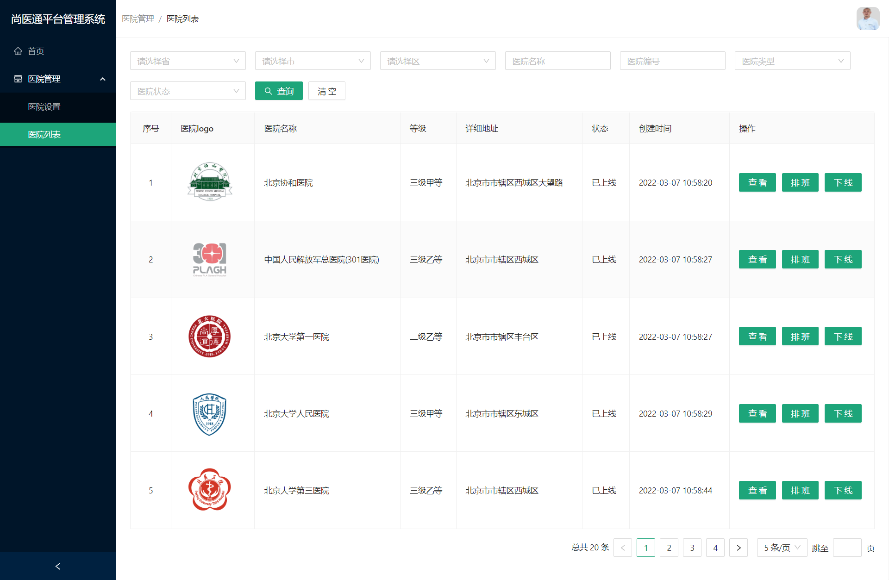
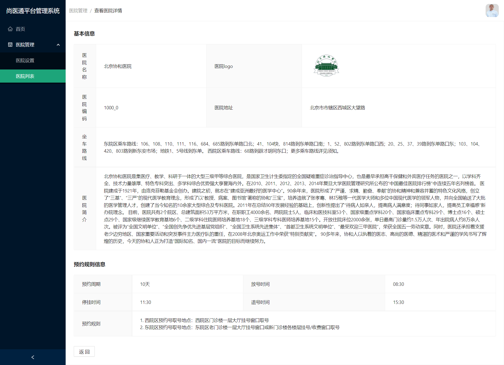
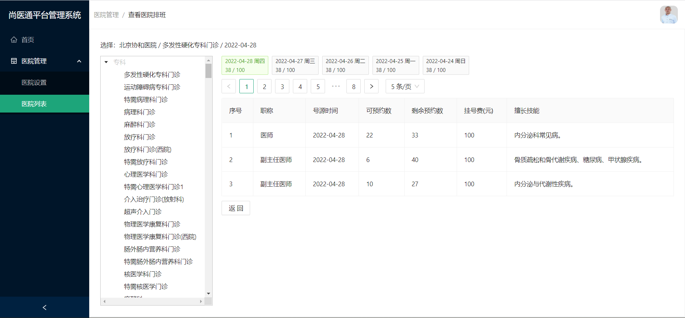
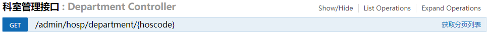

# 医院管理 - 医院列表

- 医院列表



- 查看医院



- 医院排班



## 需求介绍

1. 医院列表静态组件
2. 医院列表数据分页展示
3. 省市区搜索条件三级联动
4. 查询医院列表
5. 清空搜索条件
6. 查看医院详情
7. 医院排班
8. 医院上线

## 搭建静态组件

可以从官方文档复制组件代码。

但是更建议从上一个 `HospitalSet` 组件复制代码更方便。

### 完成头部表单

- src/pages/hospital/hospitalList/index.tsx

```tsx
import React from "react";
import { Card, Form, Input, Button, Select } from "antd";
import { SearchOutlined } from "@ant-design/icons";

const { Option } = Select;

function HospitalList() {
  return (
    <Card>
      {/* 头部表单 */}
      <Form layout="inline">
        {/* Form、Select不支持className，只能用style写样式 */}
        <Form.Item style={{ marginBottom: 20 }}>
          <Select placeholder="请选择省" style={{ width: 200 }}>
            <Option value="111">111</Option>
            <Option value="222">222</Option>
            <Option value="333">333</Option>
          </Select>
        </Form.Item>

        <Form.Item style={{ marginBottom: 20 }}>
          <Select placeholder="请选择市" style={{ width: 200 }}>
            <Option value="111">111</Option>
            <Option value="222">222</Option>
            <Option value="333">333</Option>
          </Select>
        </Form.Item>

        <Form.Item style={{ marginBottom: 20 }}>
          <Select placeholder="请选择区" style={{ width: 200 }}>
            <Option value="111">111</Option>
            <Option value="222">222</Option>
            <Option value="333">333</Option>
          </Select>
        </Form.Item>

        <Form.Item style={{ marginBottom: 20 }}>
          <Input placeholder="医院名称" />
        </Form.Item>

        <Form.Item style={{ marginBottom: 20 }}>
          <Input placeholder="医院编号" />
        </Form.Item>

        <Form.Item style={{ marginBottom: 20 }}>
          <Select placeholder="医院类型" style={{ width: 200 }}>
            <Option value="111">111</Option>
            <Option value="222">222</Option>
            <Option value="333">333</Option>
          </Select>
        </Form.Item>

        <Form.Item style={{ marginBottom: 20 }}>
          <Select placeholder="医院状态" style={{ width: 200 }}>
            {/* 注意要使用jsx语法，才会是number类型 */}
            <Option value={0}>未上线</Option>
            <Option value={1}>已上线</Option>
          </Select>
        </Form.Item>

        <Form.Item style={{ marginBottom: 20 }}>
          <Button type="primary" icon={<SearchOutlined />} >
            查询
          </Button>
          <Button className="ml">清空</Button>
        </Form.Item>
      </Form>
    </Card>
  );
}

export default HospitalList;
```

### 完成底部分页表格

- src/pages/hospital/hospitalList/index.tsx

```tsx
import { useEffect, useState } from "react";
import { Table } from "antd";
import type { ColumnsType } from "antd/lib/table";

...
...

// 定义医院分页列表相关state
const [hospitalList, setHospitalList] = useState([]);
const [current, setCurrent] = useState(1);
const [pageSize, setPageSize] = useState(5);
const [total, setTotal] = useState(0);
const [loading, setLoading] = useState(false)

/* 
获取医院列表
*/
const getHospitalList = async (page = current, limit = pageSize) => {};

// 初始化获取分页列表显示
useEffect(() => {
  getHospitalList();
}, []);

// 表格的所有列
const columns: ColumnsType<any> = [
  {
    title: "序号",
    width: 70,
    align: 'center',
    render: (_x: any, _y: any, index: number) => {
      return index + 1;
    },
  },
  {
    title: "医院logo",
    dataIndex: "xxx", // 一开始可以不用写，在数据动态展示的时候完成即可~
  },
  {
    title: "医院名称",
    dataIndex: "xxx",
  },
  {
    title: "等级",
    dataIndex: "xxx",
  },
  {
    title: "详细地址",
    dataIndex: "xxx",
  },
  {
    title: "状态",
    dataIndex: "xxx",
  },
  {
    title: "创建时间",
    dataIndex: "xxx",
  },
  {
    title: "操作",
    width: 250,
    render: (row: any) => {
      return (
        <>
          <Button type="primary" className="hospital-btn">
            查看
          </Button>
          <Button type="primary" className="hospital-btn">
            排班
          </Button>
          <Button type="primary">上线</Button>
        </>
      );
    },
  },
];

...
...

{/* 表格和分页器 */}
<Table
  columns={columns}
  dataSource={hospitalList}
  bordered
  rowKey="id"
  pagination={{
    current,
    pageSize,
    total,
    showQuickJumper: true,
    showSizeChanger: true,
    showTotal: (total) => `总共 ${total} 条`,
    onChange: getHospitalList,
    onShowSizeChange: getHospitalList,
  }}
  scroll={{x: 1500}}
  loading={loading}
/>
```

## 数据分页展示

### 数据类型与请求函数

- 接口类型
- src/api/hospital/model/hospitalListTypes.ts

```ts
// 单个医院类型
export interface HospitalItemType {
  id: string;
  createTime: string; // 创建时间
  param: {
    hostypeString: string; // 医院类型
    fullAddress: string; // 医院完整地址
  };
  hoscode: string; // 医院编码
  hosname: string; // 医院名称
  hostype: string; // 医院类型标识
  provinceCode: string; // 省编码
  cityCode: string; // 市编码
  districtCode: string; // 区编码
  logoData: string; // 医院logo
  intro: string; // 医院介绍
  route: string; // 交通方式
  status: Status; // 状态：0：未上线 1：已上线
  bookingRule: { // 预约规则信息
    cycle: number; // 预约周期
    releaseTime: string; // 放号时间
    stopTime: string; // 停挂时间
    quitTime: string; // 退号时间
    rule: string[]; // 预约规则
  };
}

// 状态类型
export type Status = 0 | 1; // 状态：0：未上线 1：已上线

// 医院列表类型
export type HospitalListType = HospitalItemType[];

// 获取医院列表参数类型
export interface ReqGetHospitalListParams {
  page: number; // 当前页码
  limit: number; // 每页条数
  hoscode?: string; // 医院编码
  hosname?: string; // 医院名称
  hostype?: string; // 医院类型
  provinceCode?: string; // 省编码
  cityCode?: string; // 市编码
  districtCode?: string; // 区编码
  status?: Status; // 状态：0：未上线 1：已上线
}

// 获取医院列表返回值类型
export interface ReqGetHospitalListResponse {
  // 注意接口返回值字段与之前不一样~所以使用前需要测试接口
  content: HospitalListType;
  totalElements: number;
}
```


- 接口函数
- src/api/hospital/hospitalList.ts

```ts
import { request } from "@/utils/http";
import type { ReqGetHospitalListParams, ReqGetHospitalListResponse } from "./model/hospitalListTypes";

// 获取医院列表
export const reqGetHospitalList = ({
  page,
  limit,
  ...restParams // 代表剩下其他参数
}: ReqGetHospitalListParams) => {
  return request.get<any, ReqGetHospitalListResponse>(
    `/admin/hosp/hospital/${page}/${limit}`, 
    {params: restParams}
  );
};
```


### 分页列表动态展示

- src/pages/hospital/hospitalList/index.ts

```tsx
import { Card, Form, Input, Button, Select } from "antd";
import { SearchOutlined } from "@ant-design/icons";

import { useEffect, useState } from "react";
import { Table } from "antd";

import { reqGetHospitalList } from "@api/hospital/hospitalList";
import type { HospitalListType, HospitalItemType, Status } from "@api/hospital/model/hospitalListTypes";
import './index.less'
import type { ColumnsType } from "antd/lib/table";

const { Option } = Select;

/* 
医院列表路由组件
*/
function HospitalList() {
  // 定义医院分页列表相关state
  const [hospitalList, setHospitalList] = useState<HospitalListType>([]);
  const [current, setCurrent] = useState(1);
  const [pageSize, setPageSize] = useState(5);
  const [total, setTotal] = useState(0);
  const [loading, setLoading] = useState(false)

  /* 
  获取医院列表
  */
  const getHospitalList = async (page = current, limit = pageSize) => {
    // 显示loading
    setLoading(true);
    // 更新页码和每页条数
    setCurrent(page);
    setPageSize(limit);

    const res = await reqGetHospitalList({ page, limit });

    // 更新数据
    setHospitalList(res.content);
    setTotal(res.totalElements);
    setLoading(false);
  };

  // 初始化获取分页列表显示
  useEffect(() => {
    getHospitalList();
  }, []);

  // 表格的所有列
  const columns: ColumnsType<HospitalItemType> = [
    {
      title: "序号",
      width: 70,
      align: "center",
      render: (_x: any, _y: any, index: number) => {
        return index + 1;
      },
    },
    {
      title: "医院logo",
      dataIndex: "logoData", // 将dataIndex改为对应数据字段
      render: (logo: string) => (
        // base64图片技术
        // 找到一张base64格式图片，观察我们数据缺少了哪部分。加上去即可
        
      ),
    },
    {
      title: "医院名称",
      dataIndex: "hosname",
    },
    {
      title: "等级",
      // 不写dataIndex得到就是整行数据
      render: (row: HospitalItemType) => row.param.hostypeString,
    },
    {
      title: "详细地址",
      render: (row: HospitalItemType) => row.param.fullAddress,
    },
    {
      title: "状态",
      dataIndex: "status",
      render: (status: Status) => (status ? "已上线" : "未上线"),
    },
    {
      title: "创建时间",
      dataIndex: "createTime",
    },
    {
      title: "操作",
      width: 250,
      render: (row: HospitalItemType) => {
        return (
          <>
            <Button type="primary">查看</Button>
            <Button type="primary" className="ml">排班</Button>
            <Button type="primary" className="ml">上线</Button>
          </>
        );
      },
      fixed: 'right',
    },
  ];

  return (
    <Card>
      {/* 头部表单 */}
      <Form layout="inline">
        {/* Form、Select不支持className，只能用style写样式 */}
        <Form.Item style={{ marginBottom: 20 }}>
          <Select placeholder="请选择省" style={{ width: 200 }}>
            <Option value="111">111</Option>
            <Option value="222">222</Option>
            <Option value="333">333</Option>
          </Select>
        </Form.Item>

        <Form.Item style={{ marginBottom: 20 }}>
          <Select placeholder="请选择市" style={{ width: 200 }}>
            <Option value="111">111</Option>
            <Option value="222">222</Option>
            <Option value="333">333</Option>
          </Select>
        </Form.Item>

        <Form.Item style={{ marginBottom: 20 }}>
          <Select placeholder="请选择区" style={{ width: 200 }}>
            <Option value="111">111</Option>
            <Option value="222">222</Option>
            <Option value="333">333</Option>
          </Select>
        </Form.Item>

        <Form.Item style={{ marginBottom: 20 }}>
          <Input placeholder="医院名称" />
        </Form.Item>

        <Form.Item style={{ marginBottom: 20 }}>
          <Input placeholder="医院编号" />
        </Form.Item>

        <Form.Item style={{ marginBottom: 20 }}>
          <Select placeholder="医院类型" style={{ width: 200 }}>
            <Option value="111">111</Option>
            <Option value="222">222</Option>
            <Option value="333">333</Option>
          </Select>
        </Form.Item>

        <Form.Item style={{ marginBottom: 20 }}>
          <Select placeholder="医院状态" style={{ width: 200 }}>
            {/* 注意要使用jsx语法，才会是number类型 */}
            <Option value={0}>未上线</Option>
            <Option value={1}>已上线</Option>
          </Select>
        </Form.Item>

        <Form.Item style={{ marginBottom: 20 }}>
          <Button type="primary" icon={<SearchOutlined />}>
            查询
          </Button>
          <Button className="ml">清空</Button>
        </Form.Item>
      </Form>

      {/* 表格和分页器 */}
      <Table
        columns={columns}
        dataSource={hospitalList}
        bordered
        rowKey="id"
        pagination={{
          current,
          pageSize,
          total,
          showQuickJumper: true,
          showSizeChanger: true,
          showTotal: (total) => `总共 ${total} 条`,
          onChange: getHospitalList,
          onShowSizeChange: getHospitalList,
        }}
        scroll={{x: 1500}}
        loading={loading}
      />
    </Card>
  );
}

export default HospitalList;
```

## 省市区三级联动

### 功能介绍

一上来请求省份数据，点击某个省，请求市的数据，点击某个市，要请求区的数据。

**特别注意：重新选择省份时，要清空市和区的数据。重新选择市，要清空区的数据。**

### 接口文档

> [数据字典接口文档](http://139.198.34.216:8202/swagger-ui.html)

- 获取省份数据接口：
  
- 获取市/区数据接口：
  

请求参数说明：

1. 如果要请求省份数据：`dictCode` 的值应为固定字符串 `province`
2. 如果要请求市数据：`parentId` 的值应为省份的 `id`
3. 如果要请求区数据：`parentId` 的值应为市的 `id`

### 定义接口函数&类型

- 接口类型
- src/api/hospital/model/hospitalListTypes.ts

```ts
...
...

// 单个省市区数据
export interface ProvinceItem {
  id: number;
  name: string; // 名称
  value: string; // 选中的值
}

// 省市区数据列表
export type ProvinceList = ProvinceItem[];
```


- 接口函数
- src/api/hospital/hospitalList.ts

```ts

import type { ProvinceList } from "./model/hospitalListTypes";

...
...

// 获取省份数据
export const reqGetProvinceList = (dictCode = "province") => {
  return request.get<any, ProvinceList>(
    `/admin/cmn/dict/findByDictCode/${dictCode}`
  );
};

// 获取市区数据
export const reqGetCityOrDistrictList = (parentId: number) => {
  return request.get<any, ProvinceList>(
    `/admin/cmn/dict/findByParentId/${parentId}`
  );
};
```

### 获取省份数据展示

- src/pages/hospital/hospitalList/index.ts

```tsx
import { reqGetProvinceList } from "@api/hospital/hospitalList";
import type { ProvinceList } from "@api/hospital/model/hospitalListTypes";

...
...

// 省列表
const [provinceList, setProvinceList] = useState<ProvinceList>([])
// 初始化加载省列表显示
useEffect(() => {
  const getProvinceList = async () => {
    const res = await reqGetProvinceList();
    setProvinceList(res);
  };
  getProvinceList();
}, [])

...
...

<Select placeholder="请选择省" style={{ width: 200 }}>
  {provinceList.map(item => (
    <Option value={item.value} key={item.id}>
      {item.name}
    </Option>
  ))}
</Select>
```

### 选择省份显示城市列表

- src/pages/hospital/hospitalList/index.ts

```tsx
import { reqGetCityOrDistrictList } from "@api/hospital/hospitalList";

...
...

// 市列表
const [cityList, setCityList] = useState<ProvinceList>([]);
// 当省份发生变化，获取城市数据
const getCityList = async (id: number) => {
  const res = await reqGetCityOrDistrictList(id);
  setCityList(res);
};

...
...

<Select placeholder="请选择省" style={{ width: 200 }}
  onChange={getCityList}>
 ...
 ...
</Select>

...
...

<Select placeholder="请选择市" style={{ width: 200 }}>
  {cityList.map(item => (
    <Option value={item.value} key={item.id}>
      {item.name}
    </Option>
  ))}
</Select>

```

### 选择城市，请求区数据展示

- src/pages/hospital/hospitalList/index.ts

```tsx
...
...

// 区列表
const [districtList, setDistrictList] = useState<ProvinceList>([]);
// 当市发生变化，获取区数据
const getDistrictList = async (id: number) => {
  const res = await reqGetCityOrDistrictList(id);
  setDistrictList(res);
};

...
...

<Select placeholder="请选择市" style={{ width: 200 }}
  onChange={getDistrictList}>
  ...
  ...
</Select>

...
...

<Select placeholder="请选择区" style={{ width: 200 }}>
  {districtList.map(item => (
    <Option value={item.value} key={item.id}>
      {item.name}
    </Option>
  ))}
</Select>
```

### 解决重新选择省和市的问题

- src/pages/hospital/hospitalList/index.ts

```tsx
...
...

// 表单对象
const [form] = Form.useForm()

...
...

// 当省份发生变化，获取城市数据
const getCityList = async (id: number) => {
  const res = await reqGetCityOrDistrictList(id);
  setCityList(res);
  
  // 将选中的市和区值清空
  form.setFieldsValue({ cityCode: undefined, districtCode: undefined });
  // 将区列表数据清空
  setDistrictList([]);
};

// 当市发生变化，获取区数据
const getDistrictList = async (id: number) => {
  const res = await reqGetCityOrDistrictList(id);
  setDistrictList(res);
  
  // 将选中区值清空
  form.setFieldsValue({ districtCode: undefined });
};

...
...

<Form form={form} layout="inline">
  
  ...
  ...
  
  <Form.Item name="provinceCode" style={{ marginBottom: 20 }}>
    
  ...
  ...
    
  <Form.Item name="cityCode" style={{ marginBottom: 20 }}>
     
  ...
  ...
       
  <Form.Item name="districtCode" style={{ marginBottom: 20 }}>
      
  ...
  ...
    
    
  
```

## 查询医院

### 获取医院类型数据展示

- src/pages/hospital/hospitalList/index.ts

```tsx
...
...

// 医院类型列表
const [hosTypeList, setHosTypeList] = useState<ProvinceList>([]);
// 初始化获取医院类型列表
useEffect(() => {
  const getHosTypeList = async () => {
    // 通过查看已完成项目，得知医院类型的id为10000, 这样就能找到所有类型了
    const result = await reqGetCityOrDistrictList(10000);
    setHosTypeList(result);
  };
  getHosTypeList();
}, []);

...
...

<Select placeholder="医院类型" style={{ width: 200 }}>
  {hosTypeList.map(item => (
    <Option value={item.value} key={item.id}>
      {item.name}
    </Option>
  ))}
</Select>
```

### 指定表单项名称

- src/pages/hospital/hospitalList/index.ts

指定表单的字段，将来提交表单时就能收集到所有数据了~

```tsx
...
...

{/* 医院名称 */}
<Form.Item name="hosname" style={{ marginBottom: 20 }}>

{/* 医院编号 */}
<Form.Item name="hoscode" style={{ marginBottom: 20 }}>

{/* 医院类型 */}
<Form.Item name="hostype" style={{ marginBottom: 20 }}>
     
{/* 医院状态 */}
<Form.Item name="status" style={{ marginBottom: 20 }}>
  
```

### 搜索医院列表

- src/pages/hospital/hospitalList/index.ts

```tsx
/* 
获取医院列表
*/
const getHospitalList = async (page = current, limit = pageSize) => {

  ...
    ...

  // 读取表单的值, 将其传入请求函数参数对象中
  const values = form.getFieldsValue();
  const res = await reqGetHospitalList({ page, limit, ...values });

  ...
    ...
};
  
...
...

<Button onClick={() => getHospitalList()} type="primary" icon={<SearchOutlined />}>
	查询
</Button>
```

### 清空搜索条件

- src/pages/hospital/hospitalList/index.ts

```tsx
...
...

// 清空
const reset = () => {
  // 清空输入/选择的数据
  form.resetFields();
  // 将城市和区的列表数据清空
  setCityList([]);
  setDistrictList([]);
  // 重新获取数据
  getHospitalList(1, 5);
};

...
...

<Button className="ml" onClick={reset}>清空</Button>
```

## 查看医院详情

### 定义路由组件

- src/pages/hospital/hospitalList/components/HospitalShow.tsx

```tsx
/* 
医院详情路由组件
*/
function HospitalShow() {
  return <div>HospitalShow</div>;
}

export default HospitalShow;
```

### 配置路由

- src/routes/index.tsx

```tsx
...
...

const HospitalShow = lazy(
  () => import("@pages/hospital/hospitalList/components/HospitalShow")
);

...
...

{
  path: "/syt/hospital/hospitalList/show/:id",
  meta: { title: "查看医院详情" },
  element: load(HospitalShow),
  hidden: true,
},

```

### 点击跳转路由

- src/pages/hospital/hospitalList/index.ts

```tsx
import { useNavigate } from "react-router-dom";

...
...

<Button type="primary" onClick={goHospitalShow(row.id)}>查看</Button>

...
...

const navigate = useNavigate();
// 跳转到医院详情
const goHospitalShow = (id: string) => {
  return () => {
    navigate(`/syt/hospital/hospitalList/show/${id}`);
  };
};
```

### 搭建静态组件

- src/pages/hospital/hospitalList/components/HospitalShow.tsx

```tsx
import { Card, Descriptions, Button } from "antd";

/* 
医院详情路由组件
*/
function HospitalShow() {
  return (
    <Card>
      {/* 
        title 标题
        bordered 带边框
        column 一行的 DescriptionItems 数量
      */}
      <Descriptions title="基本信息" bordered column={2}>
        <Descriptions.Item label="医院名称" labelStyle={{width: 200}}>xxx</Descriptions.Item>
        <Descriptions.Item label="医院logo">xxx</Descriptions.Item>
        <Descriptions.Item label="医院编码">xxx</Descriptions.Item>
        <Descriptions.Item label="医院地址">xxx</Descriptions.Item>
        {/* 
          span={2} 包含列的数量
        */}
        <Descriptions.Item label="坐车路线" span={2}>
          xxx
        </Descriptions.Item>
        <Descriptions.Item label="医院简介" span={2}>
          xxx
        </Descriptions.Item>
      </Descriptions>

      <Descriptions title="预约规则信息" bordered column={2} style={{ margin: "30px 0" }}>
        <Descriptions.Item label="预约周期">xxx</Descriptions.Item>
        <Descriptions.Item label="放号时间">xxx</Descriptions.Item>
        <Descriptions.Item label="停挂时间">xxx</Descriptions.Item>
        <Descriptions.Item label="退号时间">xxx</Descriptions.Item>
        {/* 
          span={2} 包含列的数量
        */}
        <Descriptions.Item label="预约规则" span={2}>
          xxx
        </Descriptions.Item>
      </Descriptions>

      <Button>返回</Button>
    </Card>
  );
}

export default HospitalShow;
```

### 定义接口函数&类型

- 接口类型

之前单个医院数据结构：

```ts
{
  "id": "622574cc36a9ba1be763dad8",
  "createTime": "2022-03-07 10:58:20",
  "updateTime": "2022-03-07 10:58:20",
  "isDeleted": 0,
  "param": {
    "hostypeString": "三级甲等",
    "fullAddress": "北京市市辖区西城区大望路"
  },
  "hoscode": "1000_0",
  "hosname": "北京协和医院",
  "hostype": "1",
  "provinceCode": "110000",
  "cityCode": "110100",
  "districtCode": "110102",
  "address": "大望路",
  "logoData": "xxx",
  "intro": "xxx",
  "status": 0,
  "bookingRule": {
    "cycle": 10,
    "releaseTime": "08:30",
    "stopTime": "11:30",
    "quitDay": -1,
    "quitTime": "15:30",
    "rule": [
      "西院区预约号取号地点：西院区门诊楼一层大厅挂号窗口取号",
      "东院区预约号取号地点：东院区老门诊楼一层大厅挂号窗口或新门诊楼各楼层挂号/收费窗口取号"
    ]
  }
}
```

现在医院详情数据结构：

```ts
 {
  "bookingRule": {
    "cycle": 10,
    "releaseTime": "08:30",
    "stopTime": "11:30",
    "quitDay": -1,
    "quitTime": "15:30",
    "rule": [
      "西院区预约号取号地点：西院区门诊楼一层大厅挂号窗口取号",
      "东院区预约号取号地点：东院区老门诊楼一层大厅挂号窗口或新门诊楼各楼层挂号/收费窗口取号"
    ]
  },
  "hospital": {
    "id": "622574cc36a9ba1be763dad8",
    "createTime": "2022-03-07 10:58:20",
    "updateTime": "2022-03-07 10:58:20",
    "isDeleted": 0,
    "param": {
      "hostypeString": "三级甲等",
      "fullAddress": "北京市市辖区西城区大望路"
    },
    "hoscode": "1000_0",
    "hosname": "北京协和医院",
    "hostype": "1",
    "provinceCode": "110000",
    "cityCode": "110100",
    "districtCode": "110102",
    "address": "大望路",
    "logoData": "xxx",
    "intro": "xxxx",
    "status": 0,
    "bookingRule": null
  }
}
```

发现什么了吗？他们数据结构基本一致，就是医院详情将 `bookingRule` 单独定义了，剩下都在 `hospital` 中。

所以我们可以想办法复用类型。

- src/api/hospital/model/hospitalListTypes.ts

```ts
// 单独定义，预约规则信息类型
export interface BookingRuleType {
  cycle: number; // 预约周期
  releaseTime: string; // 放号时间
  stopTime: string; // 停挂时间
  quitTime: string; // 退号时间
  rule: string[]; // 预约规则
}

// 单独定义，单个医院类型(不包含预约规则信息)
export interface HospitalType {
  id: string;
  createTime: string; // 创建时间
  param: {
    hostypeString: string; // 医院类型
    fullAddress: string; // 医院完整地址
  };
  hoscode: string; // 医院编码
  hosname: string; // 医院名称
  hostype: string; // 医院类型标识
  provinceCode: string; // 省编码
  cityCode: string; // 市编码
  districtCode: string; // 区编码
  logoData: string; // 医院logo
  intro: string; // 医院介绍
  route: string; // 交通方式
  status: Status; // 状态：0：未上线 1：已上线
}

// 单个医院类型
export interface HospitalItemType extends HospitalType {
  bookingRule: BookingRuleType;
}

// 医院详情类型
export interface HospitalShowType {
  bookingRule: BookingRuleType; // 预约规则信息
  hospital: HospitalType;
}

...
...
```


- 接口函数
- src/api/hospital/hospitalList.ts

```ts
import type { HospitalShowType } from "./model/hospitalListTypes";

...
...

// 获取医院详情
export const reqGetHospitalShow = (id: string) => {
  return request.get<any, HospitalShowType>(`/admin/hosp/hospital/show/${id}`);
};
```


### 动态显示详情

- src/pages/hospital/hospitalList/components/HospitalShow.tsx

```tsx
import { Card, Descriptions, Button } from "antd";

import type { HospitalShowType } from "@/api/hospital/model/hospitalListTypes";
import { useEffect, useState } from "react";
import { useParams } from "react-router-dom";
import { reqGetHospitalShow } from "@/api/hospital/hospitalList";

import '../index.less'

/* 
医院详情路由组件
*/
function HospitalShow() {

  // 数据初始化要按照数据结构全部进行初始化(因为属性是必填项)
  const [hospitalShow, setHospitalShow] = useState<HospitalShowType>({
    bookingRule: {
      cycle: 0,
      releaseTime: "",
      stopTime: "",
      quitTime: "",
      rule: [],
    },
    hospital: {
      id: "",
      createTime: "",
      param: {
        hostypeString: "",
        fullAddress: "",
      },
      hoscode: "",
      hosname: "",
      hostype: "",
      provinceCode: "",
      cityCode: "",
      districtCode: "",
      logoData: "",
      intro: "",
      route: "",
      status: 0,
    },
  });

  // 获取路由参数
  const params = useParams();

  // 初始化获取医院详情数据显示
  useEffect(() => {
    const getHospitalShow = async () => {
      const res = await reqGetHospitalShow(params.id as string);
      setHospitalShow(res);
    };
    getHospitalShow();
  }, []);

  return (
    <Card>
      {/* 
        title 标题
        bordered 带边框
        column 一行的 DescriptionItems 数量
      */}
      <Descriptions title="基本信息" bordered column={2}>
        <Descriptions.Item label="医院名称">
          {hospitalShow.hospital.hosname}
        </Descriptions.Item>
        <Descriptions.Item label="医院logo">
          
        </Descriptions.Item>

        <Descriptions.Item label="医院编码">
          {hospitalShow.hospital.hoscode}
        </Descriptions.Item>
        <Descriptions.Item label="医院地址">
          {hospitalShow.hospital.param.fullAddress}
        </Descriptions.Item>
        {/*
          span={2} 包含列的数量
        */}
        <Descriptions.Item label="坐车路线" span={2}>
          {hospitalShow.hospital.route}
        </Descriptions.Item>
        <Descriptions.Item label="医院简介" span={2}>
          {hospitalShow.hospital.intro}
        </Descriptions.Item>
      </Descriptions>

      <Descriptions
        title="预约规则信息"
        bordered
        column={2}
        style={{ margin: "30px 0" }}
      >
        <Descriptions.Item label="预约周期">
          {hospitalShow.bookingRule.cycle}天
        </Descriptions.Item>
        <Descriptions.Item label="放号时间">
          {hospitalShow.bookingRule.releaseTime}
        </Descriptions.Item>
        <Descriptions.Item label="停挂时间">
          {hospitalShow.bookingRule.stopTime}
        </Descriptions.Item>
        <Descriptions.Item label="退号时间">
          {hospitalShow.bookingRule.quitTime}
        </Descriptions.Item>
        {/*
          span={2} 包含列的数量
        */}
        <Descriptions.Item label="预约规则" span={2}>
          {hospitalShow.bookingRule.rule.map((rule, index) => {
            return (
              <div key={index}>
                {index + 1}. {rule}
              </div>
            );
          })}
        </Descriptions.Item>
      </Descriptions>

      <Button>返回</Button>
    </Card>
  );
}

export default HospitalShow;
```


### 点击返回

- src/pages/hospital/hospitalList/components/HospitalShow.tsx

```tsx
import { useNavigate } from "react-router-dom";

...
...

// 创建路由导航函数
const navigate = useNavigate();
// 返回
const goBack = () => {
  navigate("/syt/hospital/hospitalList");
};

...
...

<Button onClick={goBack}>返回</Button>
```

## 医院排班

### 定义路由组件

- src/pages/hospital/hospitalList/components/HospitalSchedule.tsx

```tsx
function HospitalSchedule() {
  return <div>HospitalSchedule</div>;
}


export default HospitalSchedule;
```

### 配置路由

- src/routes/index.tsx

```tsx
...
...

const HospitalSchedule = lazy(
  () => import("@pages/hospital/hospitalList/components/HospitalSchedule")
);

...
...

{
  path: "/syt/hospital/hospitalList/schedule/:id",
  meta: { title: "查看医院排班" },
  element: load(HospitalSchedule),
  hidden: true,
},
```

### 点击路由跳转

- src/pages/hospital/hospitalList/index.ts

```tsx
...
...

<Button type="primary" className="ml" onClick={goHospitalSchedule(row.hoscode)}>排班</Button>

...
...

// 跳转到医院排班
const goHospitalSchedule = (hoscode: string) => {
  return () => {
    navigate(`/syt/hospital/hospitalList/schedule/${hoscode}`);
  };
};
```

### 搭建静态组件

- src/pages/hospital/hospitalList/components/HospitalSchedule.tsx

```tsx
import { useState } from "react";
import { Card, Row, Col, Tree, Tag, Pagination, Table } from "antd";

function HospitalSchedule() {
  /*
    窗口高度 - Header组件高度（64） - 导航 34 - Card的上下padding（24*2） 
            - p元素的高度（22）和下外边距（14） - 防止纵向滚动条（5）
  */
  const treeHeight =
    document.body.getBoundingClientRect().height - 64 -34 - 24 * 2 - 22 - 14 - 5;

  // 树形数据
  const treeData = [
    {
      title: "parent 1",
      key: "0-0",
      children: [
        {
          title: "parent 1-0",
          key: "0-0-0",
          children: [
            {
              title: "leaf",
              key: "0-0-0-0",
            },
            {
              title: "leaf",
              key: "0-0-0-1",
            },
          ],
        },
        {
          title: "parent 1-1",
          key: "0-0-1",
          children: [
            {
              title: <span style={{ color: "#1890ff" }}>sss</span>,
              key: "0-0-1-0",
            },
          ],
        },
      ],
    },
  ];

  // 选择触发的事件
  const onSelect = (selectedKeys: React.Key[], info: any) => {
    console.log("selected", selectedKeys, info);
  };

  // 默认展开的树形数据的key
  const defaultExpandedKeys = ["0-0"];

  // 分页器
  const [current, setCurrent] = useState(1);
  const [pageSize, setPageSize] = useState(5);
  const [total, setTotal] = useState(0);

  // 页码改变的监听回调
  const handleChange = () => {};

  // 表格的列
  const columns = [
    {
      title: "序号",
      render: (_a: any, _b: any, index: number) => {
        return index + 1;
      },
    },
    {
      title: "职称",
      dataIndex: "xxx",
    },
    { title: "号源时间", dataIndex: "xxx" },

    {
      title: "可预约数",
      dataIndex: "xxx",
    },
    {
      title: "剩余预约数",
      dataIndex: "xxx",
    },
    {
      title: "挂号费(元)",
      dataIndex: "xxx",
    },
    {
      title: "擅长技能",
      dataIndex: "xxx",
    },
  ];
 
  // 排班列表
  const [scheduleList, setScheduleList] = useState([]);

  return (
    <Card>
      <p>选择：北京协和医院 / 多发性硬化专科门诊 / 2022-04-28</p>
      {/* 
        Row/Col是响应式布局组件，也叫做栅格布局
        类似于Bootstrap中的栅格布局，不同的是：一行分为24等份

        Row 行
          gutter={20}
          列与列的间距，单位px
        Col 列
          span={4} 占一行4等份
      */}
      <Row gutter={20}>
        <Col span={5}>
          <div
            style={{
              height: treeHeight,
              border: "1px solid silver",
              overflow: "scroll",
            }}
          >
            <Tree
              treeData={treeData}
              onSelect={onSelect}
              defaultExpandedKeys={defaultExpandedKeys}
            />
          </div>
        </Col>
        <Col span={19}>
          <Tag style={{ marginBottom: 10, cursor: "pointer" }} color={"green"}>
            <div>2022-04-28 周四</div>
            <div>38 / 100</div>
          </Tag>
          <Tag style={{ marginBottom: 10, cursor: "pointer" }} color={""}>
            <div>2022-04-28 周五</div>
            <div>38 / 100</div>
          </Tag>

          <Pagination
            showSizeChanger
            onChange={handleChange}
            current={current}
            pageSize={pageSize}
            total={total}
            pageSizeOptions={[5, 10, 15, 20]}
          />

          <Table
            style={{ marginTop: 10 }}
            columns={columns}
            dataSource={scheduleList}
            bordered
            rowKey="id"
            pagination={false}
          />
        </Col>
      </Row>
    </Card>
  );
}

export default HospitalSchedule;
```

### 定义接口函数&类型

整个页面一共需要发送三个请求：

1. 医院科室数据：Tree 数据
   
2. 排班规则数据：Tag 数据
   
3. 详细医生排班数据：Table 数据
   


- 定义类型
- src/api/hospital/model/hospitalListTypes.ts

```ts
// 单个医院科室类型
export interface DepartmentItem {
  depcode: string; // 科室编码
  depname: string; // 科室名称
  children: DepartmentList | null;
}
// 医院科室列表类型
export type DepartmentList = DepartmentItem[];

// 公共参数类型
export interface commonScheduleParams {
  hoscode: string; // 医院编码
  depcode: string; // 科室编码
}

// 获取排班规则参数类型
export interface ReqGetScheduleRuleListParams extends commonScheduleParams {
  page: number; // 当前页码
  limit: number; // 每页条数
}

// 单个排班规则类型
export interface ScheduleRuleItem {
  availableNumber: number; // 已预约数
  dayOfWeek: string; // 星期几
  reservedNumber: number; // 总可预约数
  workDate: string; // 具体日期
}

// 排班规则列表类型
export type ScheduleRuleList = ScheduleRuleItem[];

// 获取排班规则响应类型
export interface ReqGetHospitalRuleListResponse {
  total: number;
  bookingScheduleList: ScheduleRuleList;
  baseMap: {
    hosname: string; // 医院名称
  };
}

// 获取详细医生排班参数类型
export interface ReqGetScheduleListParams extends commonScheduleParams {
  workDate: string;
}

// 单个详细医生排班数据类型
export interface ScheduleItem {
  amount: number; // 挂号费
  availableNumber: number; // 可预约数
  id: string;
  reservedNumber: number; // 剩余预约数
  skill: string; // 擅长技能
  title: string; // 职称
  workDate: string; // 号源时间
}

// 详细医生排班数列表据类型
export type ScheduleList = ScheduleItem[];
```


- 定义接口
- src/api/hospital/hospitalList.ts

```ts
import type {
  DepartmentList,
  ReqGetHospitalRuleListResponse,
  ReqGetScheduleListParams,
  ReqGetScheduleRuleListParams,
  ScheduleList,
} from "./model/hospitalListTypes";
  
...
...

// 获取医院科室数据
export const reqGetDepartmentList = (hoscode: string) => {
  return request.get<any, DepartmentList>(`/admin/hosp/department/${hoscode}`);
};

// 获取排班规则数据
export const reqGetScheduleRuleList = ({
  page,
  limit,
  hoscode,
  depcode,
}: ReqGetScheduleRuleListParams) => {
  return request.get<any, ReqGetHospitalRuleListResponse>(
    `/admin/hosp/schedule/getScheduleRule/${page}/${limit}/${hoscode}/${depcode}`
  );
};

// 获取详细医生排班数据
export const reqGetScheduleList = ({
  hoscode,
  depcode,
  workDate,
}: ReqGetScheduleListParams) => {
  return request.get<any, ScheduleList>(
    `/admin/hosp/schedule/findScheduleList/${hoscode}/${depcode}/${workDate}`
  );
};
```

### 动态展示科室树状列表

- src/pages/hospital/hospitalList/components/HospitalSchedule.tsx

```tsx
import { useEffect } from "react";
import type { DepartmentList } from "@/api/hospital/model/hospitalListTypes";
import { useParams } from "react-router-dom";
import { reqGetDepartmentList } from "@/api/hospital/hospitalList";

...
...

// 医院科室数据
const [departmentList, setDepartmentList] = useState<DepartmentList>([]);

const params = useParams();

// 获取医院科室数据
const getDepartmentList = async () => {
  const res = await reqGetDepartmentList(params.id as string);
  setDepartmentList(res);
};

useEffect(() => {
  getDepartmentList();
}, []);

...
...

<Tree
  // https://github.com/ant-design/ant-design/issues/32912
  // 目前antd官方没有太好解决方案，只有临时方案
  treeData={departmentList as []}
  fieldNames={{
    title: "depname",
      key: "depcode",
  }}
  onSelect={onSelect}
  defaultExpandedKeys={defaultExpandedKeys}
/>
```

### 展开所有科室

- src/pages/hospital/hospitalList/components/HospitalSchedule.tsx

```tsx
import { Key } from "react";

...
...

// 展开的key列表
const [expandedKeys, setExpandedKeys] = useState<Key[]>([])

...
...

// 获取医院科室数据
const getDepartmentList = async () => {
  const res = await reqGetDepartmentList(params.id as string);
  // 设置医院科室数据
  setDepartmentList(res);
  
  // 设置展开的医院数据
  setExpandedKeys(res.map((item) => item.depcode));
};

<Tree
  
	...
  ...
  
  // defaultExpandedKeys只会第一次生效，导致请求生成的expandedKeys没法生效，所以得用expandedKeys
  expandedKeys={expandedKeys}
/>

```

### 动态展示排班规则列表

- src/pages/hospital/hospitalList/components/HospitalSchedule.tsx

```tsx
import { reqGetScheduleRuleList } from "@api/hospital/hospitalList";
import type { ScheduleRuleList } from "@api/hospital/model/hospitalListTypes";

...
...

// 获取医院科室数据
const getDepartmentList = async () => {
  const res = await reqGetDepartmentList(params.id as string);
  // 设置医院科室数据
  setDepartmentList(res);
  // 设置展开的医院数据
  setExpandedKeys(res.map((item) => item.depcode));

  // 必须返回请求的结果数据
  return res
};

useEffect(() => {
  const fetchData = async () => {
    const departmentList = await getDepartmentList();
    // 默认用医院科室的第一个数据的第一个子元素的depcode
    await getScheduleRuleList(
      departmentList[0].children ? departmentList[0].children[0].depcode : ""
    );
  };

  fetchData();
}, []);

// 医院科室数据
const [scheduleRuleList, setScheduleRuleList] = useState<ScheduleRuleList>([]);
// 获取排班规则数据
const getScheduleRuleList = async (depcode: string) => {
  const res = await reqGetScheduleRuleList({
    page: current,
    limit: pageSize,
    hoscode: params.id as string,
    // 默认用医院科室的第一个数据的第一个子元素的depcode
    depcode,
  });
  // 设置排班规则数据
  setScheduleRuleList(res.bookingScheduleList);
  // 设置总数
  setTotal(res.total);
};

...
...

{scheduleRuleList.map((item) => {
  return (
    <Tag
      style={{ marginBottom: 10, cursor: "pointer" }}
      color={"green"}
      >
      <div>
        {item.workDate} {item.dayOfWeek}
      </div>
      <div>
        {item.availableNumber} / {item.reservedNumber}
      </div>
    </Tag>
  );
})}

```

### 动态展示详细医生排班列表

- src/pages/hospital/hospitalList/components/HospitalSchedule.tsx

```ts
import {reqGetScheduleList} from "@api/hospital/hospitalList";
import type {ScheduleList} from "@api/hospital/model/hospitalListTypes";

...
...

// 获取医院科室数据
const getDepartmentList = async (hoscode: string) => {
  const res = await reqGetDepartmentList(hoscode);
  // 设置医院科室数据
  setDepartmentList(res);
  // 设置展开的医院数据
  setExpandedKeys(res.map((item) => item.depcode));

  // 必须返回请求的结果数据
  return res
};

// 初始化获取科室列表, 排班规则列表 和 排班列表
useEffect(() => {
  const fetchData = async () => {
    const hoscode = params.id as string;
    const departmentList = await getDepartmentList(hoscode);

    // 默认用医院科室的第一个数据的第一个子元素的depcode
    const depcode = departmentList[0].children
      ? departmentList[0].children[0].depcode
      : "";
    const scheduleRuleList = await getScheduleRuleList(hoscode, depcode);

    // 默认用排班规则第一个规则的workDate
    const workDate = scheduleRuleList[0].workDate;
    getScheduleList(hoscode, depcode, workDate);
  };

  fetchData();
}, []);

// 医院科室数据
const [scheduleRuleList, setScheduleRuleList] = useState<ScheduleRuleList>([]);
// 获取排班规则数据
const getScheduleRuleList = async (hoscode: string, depcode: string) => {
  const res = await reqGetScheduleRuleList({
    page: current,
    limit: pageSize,
    hoscode,
    // 默认用医院科室的第一个数据的第一个子元素的depcode
    depcode,
  });
  // 设置排班规则数据
  setScheduleRuleList(res.bookingScheduleList);
  // 设置总数
  setTotal(res.total);

  return res.bookingScheduleList
};

// 排班列表
const [scheduleList, setScheduleList] = useState<ScheduleList>([]);
// 获取排班规则数据
const getScheduleList = async (
  hoscode: string,
  depcode: string,
  workDate: string
) => {
  const res = await reqGetScheduleList({
    hoscode,
    depcode,
    workDate,
  });
  // 设置排班规则数据
  setScheduleList(res);
};


// 获取医院科室数据
const getDepartmentList = async (hoscode: string) => {
  const res = await reqGetDepartmentList(hoscode);
  // 设置医院科室数据
  setDepartmentList(res);
  // 设置展开的医院数据
  setExpandedKeys(res.map((item) => item.depcode));

  // 必须返回请求的结果数据
  return res
};

// 初始化获取科室列表, 排班规则列表 和 排班列表
useEffect(() => {
  const fetchData = async () => {
    const hoscode = params.id as string;
    const departmentList = await getDepartmentList(hoscode);

    // 默认用医院科室的第一个数据的第一个子元素的depcode
    const depcode = departmentList[0].children
      ? departmentList[0].children[0].depcode
      : "";
    const scheduleRuleList = await getScheduleRuleList(hoscode, depcode);

    // 默认用排班规则第一个规则的workDate
    const workDate = scheduleRuleList[0].workDate;
    getScheduleList(hoscode, depcode, workDate);
  };

  fetchData();
}, []);

// 医院科室数据
const [scheduleRuleList, setScheduleRuleList] = useState<ScheduleRuleList>([]);
// 获取排班规则数据
const getScheduleRuleList = async (hoscode: string, depcode: string) => {
  const res = await reqGetScheduleRuleList({
    page: current,
    limit: pageSize,
    hoscode,
    // 默认用医院科室的第一个数据的第一个子元素的depcode
    depcode,
  });
  // 设置排班规则数据
  setScheduleRuleList(res.bookingScheduleList);
  // 设置总数
  setTotal(res.total);

  return res.bookingScheduleList
};

// 排班列表
const [scheduleList, setScheduleList] = useState<ScheduleList>([]);
// 获取排班规则数据
const getScheduleList = async (
  hoscode: string,
  depcode: string,
  workDate: string
) => {
  const res = await reqGetScheduleList({
    hoscode,
    depcode,
    workDate,
  });
  // 设置排班规则数据
  setScheduleList(res);
};

// 表格
  const columns = [
    {
      title: "序号",
      render: (_a: any, _b: any, index: number) => {
        return index + 1;
      },
    },
    {
      title: "职称",
      dataIndex: "title",
    },
    { title: "号源时间", dataIndex: "workDate" },

    {
      title: "可预约数",
      dataIndex: "availableNumber",
    },
    {
      title: "剩余预约数",
      dataIndex: "reservedNumber",
    },
    {
      title: "挂号费(元)",
      dataIndex: "amount",
    },
    {
      title: "擅长技能",
      dataIndex: "skill",
    },
  ];

```

### 显示选择导航内容

- src/pages/hospital/hospitalList/components/HospitalSchedule.tsx

```tsx
// 初始化获取科室列表, 排班规则列表 和 排班列表
useEffect(() => {
  const fetchData = async () => {
    
    ...
    ...

    // 指定科室
    const depname = departmentList[0].children
    ? departmentList[0].children[0].depname
    : "";
    setDepname(depname);

    ...
    ...
  };

  fetchData();
}, []);
  
 ...
 ...
 
 // 获取排班规则数据
 const getScheduleRuleList = async (hoscode: string, depcode: string) => {
		
   ...
   ...

   // 设置医院名称
   setHosname(res.baseMap.hosname);
	
   ...
   ...
 };

 ...
 ...
 
 // 获取排班规则数据
const getScheduleList = async (
  hoscode: string,
  depcode: string,
  workDate: string
) => {
  
 	...
  ...
  
  // 设置工作时间
  setWorkDate(workDate);

};
   
...
...

<p>选择：{hosname} / {depname} / {workDate}</p>
```

### 点击科室展示新数据

1. 功能说明

- 第一层级的菜单不能点击的，子菜单才能点击
- 如果子菜单没有数据，进行提示，将后面数据清空

2. 完成功能

- src/pages/hospital/hospitalList/components/HospitalSchedule.tsx

```tsx
...
...

// 设置医院科室数据
// setDepartmentList(res);
setDepartmentList(
  res.map((item) => {
    return {
      ...item,
      disabled: true, // 禁用父级菜单
    };
  })
);

...
...

// 选择触发的事件
const onSelect = async (selectedKeys: Key[], info: any) => {
  try {
    setDepname(info.node.depname);
    const depcode = selectedKeys[0] as string;
    const hoscode = params.id as string;
    const scheduleRuleList = await getScheduleRuleList(hoscode, depcode);
    const workDate = scheduleRuleList[0].workDate;
    await getScheduleList(hoscode, depcode, workDate);
  } catch {
    setDepname("");
    setWorkDate("");
    setScheduleRuleList([]);
    setScheduleList([]);
    message.error("暂无数据");
  }
};
```

### 点击排班规则展示数据

- src/pages/hospital/hospitalList/components/HospitalSchedule.tsx

```tsx
...
...

// 选择触发的事件
const onSelect = async (selectedKeys: Key[], info: any) => {
  try {
    setDepname(info.node.depname);
    const depcode = selectedKeys[0] as string;
    const hoscode = params.id as string;
    const scheduleRuleList = await getScheduleRuleList(hoscode, depcode);
    const workDate = scheduleRuleList[0].workDate;
    await getScheduleList(hoscode, depcode, workDate);
  } catch {
    setDepname("");
    setWorkDate("");
    setScheduleRuleList([]);
    setScheduleList([]);
    message.error("暂无数据");
  }
};

<Tag
  key={item.workDate}
  style={{ marginBottom: 10, cursor: "pointer" }}
  color={workDate === item.workDate ? "green" : ""}
  onClick={setScheduleRule(item.workDate)}
>
```

### 点击分页器切换数据展示

- src/pages/hospital/hospitalList/components/HospitalSchedule.tsx

```tsx
...
...

// 获取排班规则数据
const getScheduleRuleList = async (
  hoscode: string,
  depcode: string,
  page: number,
  limit: number
) => {
  const res = await reqGetScheduleRuleList({
    page,
    limit,
    hoscode,
    // 默认用医院科室的第一个数据的第一个子元素的depcode
    depcode,
  });
  ...
  ...
};

...
...

const scheduleRuleList = await getScheduleRuleList(
  hoscode,
  depcode,
  current,
  pageSize
);
  
...
...

// 点击分页器触发的事件
const handleChange = async (page: number, limit: number) => {
  setCurrent(page);
  setPageSize(limit);

  const hoscode = params.id as string;
  const depcode = departmentList[0].children
  ? departmentList[0].children[0].depcode
  : "";

  const scheduleRuleList = await getScheduleRuleList(
    hoscode,
    depcode,
    page,
    limit
  );

  // 默认用排班规则第一个规则的workDate
  const workDate = scheduleRuleList[0].workDate;
  await getScheduleList(hoscode, depcode, workDate);
};

```

### 返回

```tsx

...
...

const navigate = useNavigate();
const goBack = () => {
  navigate("/syt/hospital/hospitalList");
};

...
...

<Button onClick={goBack}>返回</Button>

```

## 医院上线

### 定义接口函数

- src/api/hospital/hospitalList.ts

```ts

...
...

// 医院上线
export const reqUpdateHospitalStatus = (
  id: string,
  status: Status // （0：未上线 1：已上线）
) => {
  return request.get<any, null>(
    `/admin/hosp/hospital/updateStatus/${id}/${status}`
  );
};
```

### 完成功能

```tsx

...
...

{row.status === 0 ? (
 <Button type="primary" onClick={updateHospitalStatus(row.id, 1)}>
   上线
 </Button>
 ) : (
   <Button type="primary" onClick={updateHospitalStatus(row.id, 0)}>
     下线
   </Button>
)}

...
...

// 上线&下线
const updateHospitalStatus = (id: string, status: Status) => {
  return async () => {
    await reqUpdateHospitalStatus(id, status);
    message.success("更新状态成功");
    getHospitalList(current, pageSize);
  };
};
```
