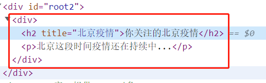
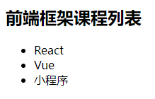

## 认识React


- React 中文文档1(国内社区)：https://react.docschina.org/   
- React 中文文档2(官方)：https://zh-hans.reactjs.org   

### React 概述

React 是一个用于`构建(动态显示)用户界面`的 JavaScript 库。 

> React 起源于 `Facebook` ,并于 2013 年 5 月开源 
>
> React本身只关注界面, 其它如：前后台交互、路由管理、状态管理等都由其扩展插件或其它第三方插件搞定
>
> React全家桶： react 、 react-router-dom、  redux

### React 三个特点

- 1 声明式  ==> 命令式编程    arr.filter(item => item.price>80)
  - 利用JSX 语法来声明描述动态页面， 数据更新界面自动更新
  - 我们不用亲自操作DOM, 只需要更新数据, 界面就会自动更新
  - React.createElement() 是命令式
- 2 组件化
  - 将一个较大较复杂的界面拆分成几个可复用的部分封装成多个组件， 再组合使用
  - 组件可以被反复使用
- 3 一次学习，随处编写
  - 不仅可以开发 web 应用（react-dom），还可以开发原生安卓或ios应用（react-native）

### React 开发的网站

- MDN: https://developer.mozilla.org/zh-CN/
- 知乎: https://www.zhihu.com/
- 阿里云: https://www.aliyun.com/
- 美团: https://bj.meituan.com/
- 飞猪旅行: https://www.fliggy.com/?spm=181.11358650.0.0.6718223eLhsSSU
- ...

### 安装VSCode插件

- ES7+ React
- open in browser


## React基本使用

### 基本使用步骤


1. 引入两个JS文件（ 注意引入顺序 ）

   ```javascript
   <!-- react库, 提供React对象 -->
   <script src="../js/react.development.js"></script>
   <!-- react-dom库, 提供了ReactDOM对象 -->
   <script src="../js/react-dom.development.js"></script>
   ```

2. 在html定义一个根容器标签 

   ```html
   <div id="root"></div>
   ```

3. 创建react元素(类似html元素)

   ```js
   // 返回值：React元素 
   // 参数1：要创建的React元素名称 =》字符串
   // 参数2：元素的属性  =》对象 {id: 'box'} 或者 null
   // 后面参数：该React元素的所有子节点 =》文本或者其他react元素
   const element = React.createElement(
     'h1', 
     {title: '你好, React!'}, 
     'Hello React!'
   )
   ```

4. 渲染 react 元素

   ```js
   // 渲染React元素到页面容器div中
   ReactDOM.render(element, document.getElementById('root'))
   ```


### 特殊属性


- class  ==》 className

```js
const element = React.createElement(
  'h1', 
  {
    title: '你好, React!',
    className: 'active'
  }, 
  'Hello React!'
)
```


### 再来个复杂点的



```js
const title = '北京疫情'
const content = '北京这段时间疫情还在持续中...'

const vDom = React.createElement('div', null, 
  React.createElement('h2', {title}, '你关注的北京疫情'),
  React.createElement('p', null, content)
)
ReactDOM.render(vDom, document.getElementById('root2'))

```


### 理解 React 元素

1. 也称`虚拟 DOM` (virtual DOM) 或`虚拟节点`(virtual Node)

2. 它就是一个普通的 JS 对象, 它不是真实 DOM 元素对象

   虚拟 DOM: 属性比较少  ==> `较轻`的对象

   真实 DOM: 属性特别多  ==> `较重`的对象

3. 但它有一些自己的特点

   虚拟 DOM 可以转换为对应的真实 DOM  => ReactDOM.render方法将虚拟DOM转换为真实DOM再插入页面

   虚拟 DOM 对象包含了对应的真实 DOM 的关键信息属性

   ​    标签名 => type: "h1"

   ​    标签属性 => props: {title: '你好, React!'}

   ​    子节点 => props: {children: 'Hello React!'}

## JSX

### 基本理解和使用

>`问题`:  React.createElement()写起来太复杂了
>
>`解决`:  推荐使用更加简洁的**JSX**
>
>**JSX** 是一种JS 的扩展语法, 用来快速创建 React 元素(虚拟DOM/虚拟节点)
>
>形式上像HTML标签/任意其它标签, 且标签内部是可以套JS代码的

```jsx
const h1 = <h1 className="active">哈哈哈</h1>   
```

> 浏览器并不认识 JSX 所以需要引入babel将jsx 编译成React.createElement的形式
>
> babel编译 JSX 语法的包为：@babel/preset-react 
>
> 运行时编译可以直接使用babel的完整包：babel.js
>
> 线上测试: https://www.babeljs.cn/

```html	
<!-- 必须引入编译jsx的babel库 -->
<script src="../js/babel.min.js"></script>

<!-- 必须声明type为text/babel, 告诉babel对内部的代码进行jsx的编译 -->
<script type="text/babel">
		// 创建React元素 (也称为虚拟DOM 或 虚拟节点)
		const vDom = <h1 title="你好, React2!" className="active">Hello React2!</h1>
    // 渲染React元素到页面容器div中
    ReactDOM.render(vDom, document.getElementById('root'))
</script>
```

> 注意:
>
>    ​	必须有结束标签
> ​	整个只能有一个根标签
> ​	空标签可以自闭合


### JSX中使用 JS 表达式

- JSX中使用JS表达式的语法：`{js表达式}`
- 作用: `指定动态的属性值和标签体文本`

> 1. 可以是js的表达式, 不能是js的语句
>
> 2. 可以是任意基本类型数据值, 但null、undefined和布尔值没有任何显示
>
> 3. 可以是一个js数组, 但不能是js对象
>
> 4. 可以是react元素对象
>
> 5. style属性值必须是一个包含样式的js对象

```jsx
let title = 'I Like You'
const vNode = (
  <div>
    <h3 name={title}>{title.toUpperCase()}</h3>
    <h3>{3}</h3>
    <h3>{null}</h3>
    <h3>{undefined}</h3>
    <h3>{true}</h3>
    <h3>{'true'}</h3>
    <h3>{React.createElement('div', null, 'atguigu')}</h3>
    <h3>{[1, 'abc', 3]}</h3>
    <h3 title={title} id="name" className="ative" style={{color: 'red'}}></h3>
    {/* <h3>{{a: 1}}</h3> */} 
  </div>
)
```


## 条件渲染

### if...else

```js
let vDom
if (isLoading) {
  vDom = <h2>正在加载中...</h2>
} else {
  vDom = <div>加载完成啦!</div>
}
 ReactDOM.render(vDom, document.getElementById('root'))
```

### 三元表达式

```js
const vDom = isLoading ? <h2>正在加载中2...</h2> : <div>加载完成啦2!</div>
ReactDOM.render(vDom, document.getElementById('root'))
```

### &&

```js
const vDom = isLoading && <h2>正在加载中3...</h2>
ReactDOM.render(vDom, document.getElementById('root'))
// 注意: 只适用于只在一种情况下才有界面的情况
```


> 复习增强:
>
> 表达式1 && 表达式2
>
> ​    如果表达式1对应的boolean为true, 结果就为表达式2的值
>
> ​    如果表达式1对应的boolean为false, 结果就为表达式1的值
>
> 表达式1 || 表达式1
>
> ​    如果表达式1对应的boolean为true, 结果就是表达式1的值
>
> ​    如果表达式1对应的boolean为false, 结果就为表达式2的值


## 列表渲染

- react中可以将数组中的元素依次渲染到页面上
- 可以直接往数组中存储react元素
- 推荐使用数组的 map 方法
- 注意：必须给列表项添加唯一的 key 属性, 推荐使用id作为key, 尽量不要用index作为key

> 需求: 根据下面的数组显示列表
>
> const courses = [
>   	{id: 1, name: 'React'},
>   	{id: 3, name: 'Vue'},
>   	{id: 5, name: '小程序'}
> ]



```jsx
const courses = [
  {id: 1, name: 'React'},
  {id: 3, name: 'Vue'},
  {id: 5, name: '小程序'}
]

const vDom = (
  <div>
    <h2>前端框架课程列表</h2>  
    <ul>
      {courses.map(c => <li key={c.id}>{c.name}</li>)}  
    </ul>
  </div>
)

ReactDOM.render(vDom, document.getElementById('root'))
```


## 样式处理

### 行内样式

- 样式属性名使用小驼峰命名法
- 如果样式是数值，可以省略单位

```js
<h2 style={{color: 'red', fontSize: 30}}>React style</h2>
```

### 类名

- 必须用className, 不能用class
- 推荐, 效率更高些

```js
<h2 className="title">React class</h2>
```


## 事件处理

### 绑定事件

React 元素的事件处理和 DOM 元素的很相似，但是有一点语法上的不同：

- React 事件的命名采用小驼峰式（camelCase），而不是纯小写。比如：onClick、onFocus 、onMouseEnter
- 使用 JSX 语法时你需要传入一个函数作为事件处理函数，而不是一个字符串

```javascript
const div = <div onClick={事件处理函数}></div>
```

### 事件对象 

React 根据 [W3C 规范](https://www.w3.org/TR/DOM-Level-3-Events/)来自定义的合成事件, 与原生事件不完全相同

- 处理好了浏览器的兼容性问题

- 阻止事件默认行为不能使用return false,  必须要调用: event.preventDefault()

- 有自己特有的属性, 比如: nativeEvent --原生事件对象

- <input>的change监听在输入过程中触发， 而原生是在失去焦点才触发

  - 原理：内部绑定的是原生input事件
  
  

```javascript
function handleClick1(event) {
  console.log(event)
  alert(event.target.innerHTML)
}

const handleClick2 = (event) => {
  const isOdd = Date.now()%2===1
  alert(isOdd)
  if (!isOdd) {
    // return false // 不起作用
    event.preventDefault()
  }
}

const vDom = <div>
    <button onClick={handleClick1}>点击提示按钮文本</button>
    <br/>
    <br/>
    <a href="http://www.baidu.com" onClick={handleClick2}>奇数才去百度</a>
  </div>

ReactDOM.render(vDom, document.getElementById('root'))
```


## 案例

- 需求：实现评论列表功能
  
  li> a > [h3 p]
  
  - 如果有评论数据，就展示列表结构 li（ 列表渲染 ）要包含a标签
    - name 表示评论人，渲染 h3
    - content 表示评论内容，渲染 p
  - 如果没有评论数据，就展示一个 h1 标签，内容为： 暂无评论！
  - 用户名的字体25px, 内容的字体20px
  - 点击内容区域提示它发表的时间


```js
const list = [
  { id: 1, name: 'jack', content: 'rose, you jump i jump', time: '03:21' },
  { id: 2, name: 'rose', content: 'jack, you see you, one day day', time: '03:22' },
  { id: 3, name: 'tom', content: 'jack,。。。。。', time: '03:23' }
]
```


## React的组件


组件允许你将 UI 拆分为独立可复用的代码片段，包括JS/CSS/IMG等。

组件从概念上类似于 JavaScript 函数。它接收参数（即 “**props**”），内部可以有自己的数据（即 “**state**”），并返回用于描述页面展示的 React 元素。

**一个React应用就是由一个个的React组件组成的**


## 快速创建React项目

### react脚手架使用

>问题:  JSX 转 JS 和 ES6 转 ES5 语法运行时编译太慢了
>解决: 利用 Webpack 进行打包处理
>
>问题: webpack打包环境搭建太麻烦, 且没有质量保证, 效率低
>解决: 使用官方提供的`脚手架`工具
>		搭建好了webpack打包环境
>		项目的目录结构 

### 创建React项目 

使用 create-react-app: 

1. 下载  npm i create-react-app -g
2. 创建项目命令: `create-react-app 项目名称` 


也可以利用 npx 来下载 create-react-app 并创建项目

命令: `npx create-react-app 项目名称` 

npx 做的事情: 

1. 先全局下载 create-react-app
2. 执行 create-react-app 命令, 创建 react 项目 
3. 自动将 create-react-app 从全局中删除掉


### 从V18降级到V17的版本

最新的脚手架默认使用的是最新的 React18 的版本, 而这个版本是最近才出稳定版, 企业项目还未开始使用

如何降级到V17的最新版呢?

1. 重新下载 react 和 react-dom, 并指定17的版本

   ```shell
   npm i react@17 react-dom@17
   ```

2. 修改入口JS的实现

   ```js
   import React from 'react'
   import ReactDOM from 'react-dom'
   
   import App from './App'
   
   ReactDOM.render(<App />, document.getElementById('root'))
   ```

### 安装chrome调试工具

> 问题: 一旦开始进行组件化的应用开发, 我们需要查看应用中组件组成和各个组件的相关数据(props/state)
>
> 解决: 使用React的chrome调试工具, `React Developer Tools`

-  方式一: chrome应用商品搜索 `React`, 下载安装`React Developer Tools`
  - 问题: 需要使用翻墙工具
- 方式二: 使用本地的安装包
  - 进入**扩展程序列表**
  - 打开 **开发者模式**
  - 将**安装包的文件夹**拖入扩展程序列表界面, 直接安装
-  测试
   - 访问react项目, 插件图标会亮
   - 多了调试选项: Components

## 创建组件的两种方式

### 函数组件

```javascript
 
function App() {
  // return null
  return <div>App</div>
}

// 函数名就是组件名
ReactDom.render(<App />, document.getElementById('root')) 
```

> 1. 组件名首字母必须大写. 因为react以此来区分组件元素/标签 和 一般元素/标签
>
> 2. 组件内部如果有多个标签,必须使用一个根标签包裹.只能有一个根标签
>
> 3. 必须有返回值.返回的内容就是组件呈现的结构, 如果返回值为 null，表示不渲染任何内容
>4. 会在组件标签渲染时调用, 但不会产生实例对象（this->undefined）,  不能有状态

> 注意: 后面我们会讲如何在函数组件中定义状态 ==> hooks语法

### 类组件

```javascript
import React from "react"

class App extends React.Component {
  render () {
    return <div>App Component</div>
  }
}

ReactDom.render(<App />, document.getElementById('root'))
```

> 1. 组件名首字母必须大写.
>
> 2. 组件内部如果有多个标签,必须使用一个根标签包裹.只能有一个根标签
>
> 3. 类组件应该继承 React.Component 父类，从而可以使用父类中提供的方法或属性
>4. 类组件中必须要声明一个render函数, reander返回组件代表组件界面的虚拟DOM元素
> 
>5. 会在组件标签渲染时调用, 产生实例对象(this->组件实例对象),  可以有状态


## 类组件的状态 state

函数组件又叫做无状态组件(不产生实例)，类组件又叫做有状态组件(有实例) 

状态（state）即数据 

函数组件没有state, 只能根据外部传入的数据（props）动态渲染

类组件有自己的state数据，**一旦更新state数据， 界面就会自动更新**

### state的基本使用

- 状态（state）即数据，是组件内部的私有数据，只能在组件内部使用 
- 组件对象的state属性
  - 属性值为对象, 可以在state对象中保存多个数据
  - 初始化state
    - 构造器中: this.state = {xxx: 2}
    - 类体中: state = {}
  - 读取state数据
    - this.state.xxx
  - 更新state数据
    - 不能直接更新state数据
    - 必须 this.setState({ 要修改的属性数据 })


```javascript
class StateTest extends React.Component {

  /* constructor () {
    super() // 必须调用super()
    // 初始化state
    this.state = {
      count: 0,
      xxx: 'abc'
    }
  } */
  // 初始化状态(简洁语法)
  state = {
    count: 0,
    xxx: 'abc'
  }


  render () {
    // 读取state数据
    const {count} = this.state

    return <div onClick={() => {
      // 直接更新状态数据 => 界面不会自动更新  不可用
      // this.state.count = count + 1
      
      // 通过setState()更新state => 界面会自动更新
      this.setState({
        count: count + 1
      })
    }}>点击的次数: {count}</div>
  }
}
```


### 事件回调this问题

为了提高代码的性能和阅读性,最好把事件处理函数定义在结构的外面.

但是这样就带来了this指向的问题: 

> 问题: <font color='red'>类中定义的事件回调方法中this是undefined,</font> 无法更新state
>
> 原因: 事件回调都不是组件对象调用的, 都是事件触发后,直接调用的,
>            class中所有方法都使用严格模式, 所以方法中的this就是undefined


- 基础代码：组件的虚拟DOM

  ```jsx
  <div>
    <h3>当前count为: 0</h3>
    <button>点击报错, 有this问题</button><br/>
    <button>解决办法1 - 包裹箭头函数</button><br/>
    <button>解决办法2 - bind绑定this </button><br/>
    <button>解决办法3 - 箭头函数</button>
  </div>
  ```

  

> 解决办法1 - 包裹箭头函数
> 原因: render中的this是组件对象, 处理函数是我们通过组件对象来调用的
>
> 解决办法2 - bind绑定this 
> 原因: 构造器中的this是组件对象, 将处理函数通过bind绑定为了组件对象
>
> 解决办法3 - 箭头函数
> 原理: 利用bind给事件回调绑定this为组件对象(render中的this)


```javascript
class EventThis extends React.Component {

  constructor () { // 构造器中的this是组件对象
    super()
    /* 
    this.handle4 = () =>  {
      console.log(this)
      this.setState({
        count: this.state.count + 3
      })
    } */
  }
  
	// 初始化state
  state = { count: 0 }

  /* 
  问题: 类中定义的事件回调方法中this是undefined, 无法更新state
  原因: babel编译jsx. 采用的是严格模式, 事件监听函数中this就指向undefined
  */
  handle1 () {
    console.log(this) // this是undefined
    this.setState({ // 报错
      count: this.state.count + 1
    })
  }

  handle2 () {
    console.log(this)
    this.setState({
      count: this.state.count + 2
    })
  }

  handle3 () {
    console.log(this)
    this.setState({
      count: this.state.count + 3
    })
  }

  /* 
  解决办法3 - 箭头函数
  原因: 改为箭头函数后, 变为了给组件对象添加属性, 且是在构造器中执行的, 用的就是构造函数中的this
  */
  handle4 = () =>  {
    console.log(this)
    this.setState({
      count: this.state.count + 3
    })
  }


  render () { // render中的this是组件对象
    console.log('render()', this.state.count)
    
    return (
      <div>
        <h3>当前count为: {this.state.count}</h3>
        <button onClick={this.handle1}>点击报错, 有this问题</button>
        {/* 
        解决办法1 - 包裹箭头函数
        原因: render中的this是组件对象, 处理函数是我们通过组件对象来调用的
        */}
        <button onClick={() => {this.handle2()}}>解决办法1 - 包裹箭头函数</button>
        <button onClick={this.handle3.bind(this)}>解决办法2 - bind绑定this </button>
        <button onClick={this.handle4}>解决办法3 - 箭头函数</button>
      </div>
    )
  }
}
```

> 选择:
>
> 1. 一般用`箭头函数`方式,  编码简洁
> 2. 如果要传递特定的数据, 一般选择用 `包裹箭头函数`方式

## 组件的props

### 使用

组件是封闭的，要接收外部数据应该通过 props 来实现 

 props的作用：父组件向子组件传递数据

父向子传入数据：给组件标签添加属性 

子读取父传入的数据：<font color='cornflowerblue'>函数组件</font>通过<font color='red'>参数props</font>接收数据，<font color='cornflowerblue'>类组件</font>通过 <font color='red'>this.props 接收数据 </font>

props的特点

1. 可以给组件传递任意类型的数据 
2. props 是只读的对象，只能读取属性的值，不要修改props 
3. 可以通过...运算符来将对象的多个属性分别传入子组件
4. 如果父组件传入的是动态的state数据, 那一旦父组件更新state数据, 子组件也会更新


- 子组件

  ```js
  // 函数组件
  export function FunProps(props) {
    return <h2>FunProps-个人信息: 姓名: {props.name}, 年龄: {props.age}</h2>
  }
  
  // 类组件
  export class ClassProps extends React.Component {
    render () {
      const { myName, age} = this.props
      return <h2>ClassProps-个人信息: 姓名: {myName}, 年龄: {age}</h2>
    }
  }
  ```

  

- 父组件【状态数据传递给子组件】

  ```js
  class App extends React.Component {
    state = {
      person: {
        myName: 'tom',
        age: 12
      }
    }
  
    render () {
      const {myName, age} = this.state.person
      return <div>
          <p>人员信息: {myName + ' : ' +age}</p>
          <button onClick={() => {
            this.setState({
              person: { myName: myName+'--', age: age+1}
            })
          }}>更新人员信息</button>
          <br/>
  
          <FunProps name={myName} age={age}/>
          <hr/>
          {/* <ClassProps myName={myName} age={age}/> */}
          <ClassProps {...this.state.person}/>
        </div>
    }
  }
  ```

### props校验与默认值 (了解) 

- props检验
  - 对于组件来说，props 是外来的，无法保证组件使用者传入什么格式的数据 
  - 如果传入的数据格式不对，可能会导致组件内部报错
  - 关键问题：组件的使用者不知道明确的错误原因 
  - 允许在创建组件的时候，就指定 props 的类型、格式等 
  - 作用：捕获使用组件时因为props导致的错误，给出明确的错误提示，增加组件的健壮性 
- props默认值
  - 给 props 设置默认值，在未传入 props 时生效 

> props校验: 检查接收的prop的类型和必要性
> props默认值: 如果prop没有传入, 指定默认值是多少


> 需求:
>
> ​		name/myName属性: 字符串类型, 必须的
> ​		age属性: 数值类型, 不是必须的, 默认值为0

**实现方式:**

1. 导入 prop-types 包 

2. 使用propTypes来给组件的props添加校验规则 

   

```javascript
import PropTypes from 'prop-types' // 引入属性检查的包

/* 函数组件函数体外 */
// 指定prop的类型和必要性
FunPropsCheck.propTypes = {
  myName: PropTypes.string.isRequired, 
  age: PropTypes.number,
}

// 指定prop的默认值
FunPropsCheck.defaultProps = {
  age: 0
}

/* 类组件的类体中 */
// 指定prop的类型和必要性
static propTypes = {
  name: PropTypes.string.isRequired,
  age: PropTypes.number,
}

// 指定prop的默认值
static defaultProps = {
  age: 0
}
```

## 类组件的生命周期

生命周期图谱: https://projects.wojtekmaj.pl/react-lifecycle-methods-diagram/


### 生命周期三大阶段

#### 挂载阶段

> 流程: constructor  ==> render ==> componentDidMount
>
> 触发: ReactDOM.render(): 渲染组件元素

#### 更新阶段

>流程: render  ==>  componentDidUpdate 
>
>触发: setState() , forceUpdate(), 组件接收到新的props

#### 卸载阶段

>流程: componentWillUnmount
>
>触发: 不再渲染组件

### 生命周期钩子

- constructor: 

   只执行一次: 创建组件对象挂载第一个调用

   用于初始化state属性或其它的实例属性或方法(可以简写到类体中)

- render:

   执行多次: 挂载一次 + 每次state/props更新都会调用

   用于返回要初始显示或更新显示的虚拟DOM界面

- componentDidMount:

   执行一次: 在第一次调用render且组件界面已显示之后调用

   用于初始执行一个异步操作: 发ajax请求/启动定时器等

   应用：

   1. 启动定时器
   2. 订阅消息
   3. 发送ajax请求

- componentDidUpdate:

   执行多次: 组件界面更新(真实DOM更新)之后调用

   用于数据变化后, 就会要自动做一些相关的工作(比如: 存储数据/发请求)

   用得少  => 这次我们先简单了解, 后面需要时再深入说

- componentWillUnmount:

   执行一次: 在组件卸载前调用

   用于做一些收尾工作, 如: 清除定时器、取消订阅
   
   


### 旧版react生命周期(纯了解)

>componentWillMount 
>
>componentWillUpdate,
>
>componentWillReceiveProps 
>
>以上生命周期钩子函数在React v16.3后废弃   


## Hooks [重要]

> 问题:
> 		相对于类组件, 函数组件的编码更简单, 效率也更高, 但函数组件不能有state (旧版)
>
> 解决:
> 		React 16.8版本设计了一套新的语法来让函数组件也可以有state 

- *Hook* 是 React 16.8 的新增特性。它可以让你在不编写 class 的情况下使用 state 以及其他的 React 特性
- Hook也叫钩子，**本质就是函数**，能让你使用 React 组件的状态和生命周期函数... 
- Hook 语法 基本已经代替了类组件的语法
- 后面的 React 项目就完全是用Hook语法了

### useState()

> 用来定义状态数据
>
> 可以多次调用, 产生多个状态数据


```javascript
import React from 'react'
import { useState } from 'react'

function App() {
  /* 
  useState(初始值): 返回包含内部管理的state数据和更新数据的函数的数组
  我们可以用解构的写法取出state数据和更新数据的函数
  state数据变量根据数据意义取名: xxx  => 界面根据xxx来显示
  更新数据的函数一般取名: setXxx => 调用setXxx会重新执行组件函数 (也就是重新render组件)
  第一次调用useState
  重新redner调用useState
  */
  const [count, setCount] = useState(0)
  
  return <div>
    <h2>App组件</h2>
    <p>state.count: {count}</p>
    <button onClick={() => setCount(count + 1)}>更新count</button>
  </div>
}

export default App
```


### useEffect() 

>可以在一个组件中多次使用
>
>相当于`componentDidMount，componentDidUpdate 和 componentWillUnmount`的组合


```javascript
import { useState, useEffect, Component } from 'react'

const style = {
  border: '1px solid gray',
  padding: 10,
  margin: '10px 0',
}

export default function HookTest({count}) {
  const [msg, setMsg] = useState('abc')

  // 相当于 componentDidMount
  useEffect(() => {
    console.log('effect回调...')
    /* 
    第一次执行HookLifeTest() => msg=abc, setTimeout(() => {msg}, 5000)
    更新执行HookLifeTest => msg=abc+   effect回调不会再执行
    注意: effect的回调当前情况只执行一次
    在setInterval中看到的msg一直都是初始值
    */
    const timeoutId = setTimeout(() => {
      // setMsg(msg + '+')  // 在setInterval中看到的msg一直都是初始值 => 界面只会更新一次
      setMsg(msg => msg + '+') // setMsg的回调中的msg是react从内部取出的最新值 => 界面会多次更新
    }, 1000)

    // effect回调返回的函数 相当于 willUnmount
    return () => {
      // 清除定时器
      clearTimeout(timeoutId)
    }
  }, []) // 注意这里要传入空数组 

  // componentDidMount + componentDidUpdate (所有state或props变化)
  useEffect(() => {
    console.log('effect回调2')
  })
  // 与上面的等价
  useEffect(() => {
    console.log('effect回调3')
  }, [count, msg])

  // componentDidMount + componentDidUpdate (msg变化)
  useEffect(() => {
    console.log('effect回调3')
  }, [msg])

  return (
    <div style={style}>
      <h2>LifeTest</h2>
      <h3>state.msg: {msg}</h3>
      <h3>props.count: {count}</h3>
      <button onClick={() => setMsg(msg + '+')}>更新msg</button>
    </div>
  )
}
```


### useRef

> 用于得到组件中的某个DOM元素

```jsx
import { useRef } from "react"

/* 
useRef: 用于得到组件中的某个DOM元素
1. 使用useRef创建用于存储input元素的容器对象(内部使用current属性存储)
2. 将ref容器通过ref属性交给表单项标签 => 渲染时内部会将对应的input元素保存到ref容器的current属性上
3. 点击提交按钮时, 通过ref容器的current属性得到input DOM元素 => 就可以读取其value了
*/
function HookTest2() {
  // 1. 使用useRef创建用于存储input元素的容器对象(内部使用current属性存储)
  const inputRef = useRef()
  console.log(inputRef) // {current: undefined}

  const handleClick = () => {
    // 3. 点击提交按钮时, 通过ref容器的current属性得到input DOM元素 => 就可以读取其value了
    const input = inputRef.current
    alert(input.value)
  }
  
  return <div>
    {/* 2. 将ref容器通过ref属性交给表单项标签 => 渲染时内部会将对应的input元素保存到ref容器的current属性上 */}
    <input type="text" ref={inputRef}/>
    <button onClick={handleClick}>提示输入框的值</button>
  </div>
}

export default HookTest2
```


### useContext

> 在hook组件函数中读取context的Provide提供的数数据

```js
function Child() {
  const data = useContext(context)
  return (
    <div>{data}</div>
  )
}
```

### Hook规则: 

1. 只在React组件函数内部中调用 Hook, 不要在组件函数外部调用
2. Hook调用的次数要固定, 所以不要在循环或条件判断中调用

### 官方 Hooks

- [基础 Hook](https://react.docschina.org/docs/hooks-reference.html#basic-hooks)
  - [`useState`](https://react.docschina.org/docs/hooks-reference.html#usestate)
  - [`useEffect`](https://react.docschina.org/docs/hooks-reference.html#useeffect)
  - [`useContext`](https://react.docschina.org/docs/hooks-reference.html#usecontext)
- [额外的 Hook](https://react.docschina.org/docs/hooks-reference.html#additional-hooks)
  - [`useReducer`](https://react.docschina.org/docs/hooks-reference.html#usereducer)
  - [`useCallback`](https://react.docschina.org/docs/hooks-reference.html#usecallback)
  - [`useMemo`](https://react.docschina.org/docs/hooks-reference.html#usememo)
  - [`useRef`](https://react.docschina.org/docs/hooks-reference.html#useref)
  - [`useImperativeHandle`](https://react.docschina.org/docs/hooks-reference.html#useimperativehandle)
  - [`useLayoutEffect`](https://react.docschina.org/docs/hooks-reference.html#uselayouteffect)
  - [`useDebugValue`](https://react.docschina.org/docs/hooks-reference.html#usedebugvalue)


## 收集表单数据

### 非受控组件

表单项不与state数据相向关联, 需要手动读取表单元素的值

借助于 useRef，使用原生 DOM 方式来获取表单元素值 

useRef 的作用：用于获取 DOM元素

```jsx
<form>
  <h2>登陆页面</h2>
  用户名: <input type="text"/> <br/>
  密  码: <input type="password"/> <br/>
  <input type="submit" value="登 陆"/>
</form>
```


```js
import React, { useRef } from 'react'

/* 
非受控组件:
  包含表单组件
  在输入过程中, 不将输入数据收集到state数据中, 只是提交的回调中手动读取input中的输入值
  表单项输入数据不与state数据相关联
编码过程
  1. 使用useRef创建用于存储input元素的容器对象(内部使用current属性存储)
  2. 将ref容器通过ref属性交给表单项标签 => 渲染时内部会将对应的input元素保存到ref容器的current属性上
  3. 点击提交按钮时, 通过ref容器的current属性得到input DOM元素 => 就可以读取其value了
不足:
  不够自动 / 不方便进行实时的数据检验
*/
export default function FormTest () {

  const nameRef = useRef()
  const pwdRef = useRef()
  console.log(nameRef) // {current: undefined}

  // 点击登陆的回调
  const login = (event) => {
    console.log(nameRef)

    // 阻止事件的默认行为 => 不提交表单
    event.preventDefault()
    // 得到输入框
    const nameInput = nameRef.current
    const pwdInput = pwdRef.current

    // 得到输入框的值
    const name = nameInput.value
    const pwd = pwdInput.value

    // 发送登陆的请求
    alert(`发送登陆的请求 name=${name}, pwd=${pwd}`)
  }

  return (
    <form>
      <h2>登陆页面(非受控组件)</h2>
      用户名: <input ref={nameRef}  type="text"/> <br/>
      密  码: <input ref={pwdRef} type="password"/> <br/>
      <input type="submit" value="登 陆" onClick={login}/>
    </form>
  )
}
```


### 受控组件

组件中的表单项根据状态数据动态初始显示和更新显示, 当用户输入时实时同步到状态数据中

也就是实现了页面表单项与state数据的双向绑定

**实现方式**

1. 在 state 中添加一个状态，作为表单元素的value值（控制表单元素值的来源） 
2. 给表单元素绑定 change 事件，将 表单元素的值 设置为 state 的值（控制表单元素值的变化） 

```jsx
import React, { useState } from 'react'

/* 
受控组件
  在输入过程, 实时收集到state数据中 / 界面也可以根据state数据进行显示
  表单项与state数据进行 双向同步 => 数据双向绑定  state <===> 页面的input
编码过程
  1. 使用useState定义一个state数据，作为表单元素的value值（界面根据state动态显示） 
  2. 给表单元素绑定 change 事件，将 表单元素的值 设置为 state 的值（界面输入变化时, 保存到state)
数据双向绑定
  state 到 页面 的绑定 => 将state数据指定为input的value
  页面 到 state 的绑定 => 给input绑定change事件, 在回调中将输入的最新值更新到state
好处:
  实时自动收集数据 => 需要数据时非常轻松
  方便进行实时的数据检验
*/
export default function FormTest2 () {
  // 定义state
  const [name, setName] = useState('admin')
  const [pwd, setPwd] = useState('123')

  const handleSubmit = (e) => {
    // 点击提交按钮的默认行为就是提交表单, 但不想自动提交表单 => 阻止一下事件的默认行为
    e.preventDefault()
    alert(`准备提交登陆的ajax请求 name=${name}, pwd=${pwd}`)
  }

  // 当用户名输入发生改变的回调
  const handleNameChange = (e) => {

    // 将最新输入的值更新到name状态
    const name = e.target.value
    setName(e.target.value)

    // 对name进行实时检验: 不能超过6位
    if (name.length>6) {
      alert('用户名不能超过6位')
    }
  }
  
  // 当密码输入发生改变的回调
  const handlePwdChange = (event) => {
    // 将最新输入的值更新到pwd状态
    setPwd(event.target.value)
  }

  return (
    <div>

      <h3>登陆页面(受控组件)</h3>
      <form action='/xxx'>
        {/* 2. 给表单元素绑定 change 事件，将 表单元素的值 设置为 state 的值 */}
        用户名: <input type="text" value={name} onChange={handleNameChange}/><br/>
        密码: <input type="text" value={pwd} onChange={handlePwdChange}/><br/>
        <input type="submit" value='登陆' onClick={handleSubmit}/>
      </form>

      <button onClick={() => { // 更新state, 界面会自动更新
        setName(name + '--')
        setPwd(pwd + '--')
      }}>更新状态数据</button>

    </div>
  )
}
```


**优化: 使用同一个事件函数处理*多个事件**

> 方式一: 柯里化函数
>
> 方式二: 包裹箭头函数

```js
import React, { useState } from 'react'

/* 
优化: 将2个事件函数优化为1个
方式一: 柯里化函数
方式二: 包裹箭头函数
*/
export default function FormTest3 () {
  // 定义state
  const [name, setName] = useState('admin')
  const [pwd, setPwd] = useState('123')

  const handleSubmit = (e) => {
    e.preventDefault()
    alert(`准备提交登陆的ajax请求 name=${name}, pwd=${pwd}`)
  }

  /* 
  方式一: 使用柯里化函数(也是一个高阶函数)
  */
  const handleChange = (setFn) => {
    return (event) => {
      setFn(event.target.value)
    }
  }

  /* 
  方式二: 包裹箭头函数: 在外部包一个事件回调函数, 我们在其中调用传递特定参数
  */
  const handleChange2 = (event, setFn) => {
    setFn(event.target.value)
  }

  return (
    <div>

      <h3>登陆页面(受控组件)</h3>
      <form action='/xxx'>
        用户名: <input type="text" value={name} onChange={handleChange(setName)}/><br/>
        密码: <input type="text" value={pwd} onChange={handleChange(setPwd)}/><br/>
        <input type="submit" value='登陆' onClick={handleSubmit}/>
      </form>

      <form action='/xxx'>
        用户名: <input type="text" value={name} onChange={event => handleChange2(event, setName)}/><br/>
        密码: <input type="text" value={pwd} onChange={event => handleChange2(event, setPwd)}/><br/>
        <input type="submit" value='登陆' onClick={handleSubmit}/>
      </form>

      <button onClick={() => { // 更新state, 界面会自动更新
        setName(name + '--')
        setPwd(pwd + '--')
      }}>更新状态数据</button>
    </div>
  )
}
```


## 案例- TODO List 案例


> 功能描述
>
> 1. 动态显示初始列表
> 2. 添加一个 todo
> 3. 删除一个 todo
> 4. 反选一个 todo
> 5. todo 的全部数量和完成数量
> 6. 全选/全不选 todo
> 7. 删除完成的 todo

## ajax

- 在 react 项目开发中，基本都是使用 axios 库来发送 ajax请求与后台通信

- 而发 ajax 请求的时机分下面三种情况

  - 初始化发一次请求： 在`componentDidMount`中发送 
- 在`事件回调`函中发送请求
  
- 在某个state或props数据发生改变后发送请求： 在 `componentDidUpdate` 中发送
  
- 接口1: https://api.github.com/search/repositories?q=re&sort=stars

- 接口2: http://localhost:4000/search/users?q=rc

  

### 测试案例一


### 测试案例二


### 搭建后台接口

- server.js
- 使用 node + express + axios

```js
/* 
后台服务器应用模块: 使用express快速搭建后台路由
*/

const express = require('express')
const axios = require('axios')
const app = express()

// 能解析urlencode格式的post请求体参数
app.use(express.urlencoded())
// 能解析json格式的请求体参数
app.use(express.json())

// 根路径路由
app.get('/', (req, res) => {
  res.send({status: 1, data: '我是测试数据'})
})

// 搜索用户的路由
app.get('/search/users', (req, res) => {
  // 得到query中的q参数
  const q = req.query.q
  // 使用axios请求git的接口
  axios.get('https://api.github.com/search/users', {
    params: {q}
  })
    .then(response => {
      // 得到成功的响应数据
      const result = response.data
      // 返回给浏览
      res.send(result)
    }).catch(error => {
      console.log(error.message)
    })
})

// 启动监听服务
app.listen('4000', () => {
  console.log('server listen on http://localhost:4000')
})
```

### react脚手架配置代理

> 在package.json中追加如下配置

```json
"proxy":"http://localhost:4000"
```

说明：

1. 优点：配置简单，前端请求资源时可以不加任何前缀。
2. 缺点：不能配置多个代理。=>` 后面项目中我们会讲解配置多个代理的方式`
3. 工作方式：上述方式配置代理，当请求的资源不存在时，那么该请求会转发给4000 （优先匹配前端资源）

## 组件通讯

>react组件通讯有三种方式.分别是props, context, pubsub

### props  

>单向数据流: 非函数属性通过标签属性, 由外层组件逐级传递给内层组件
>
>父子间通信
>祖孙间通信
>兄弟间通信


### context  (了解)

>与任意后代直接通信
>
>一般应用中不使用, 但一些插件库内部会使用context封装, 如: react-redux


- 调用 React. createContext() 创建 context 对象

  ```javascript
  const context = React.createContext() 
  ```
  
- 在`外部组件`中使用 context 上的 Provider 组件作为父节点, 使用value属性定义要传递的值。Provider【提供者】

  ```javascript
  <context.Provider value={要传递的值}>  提供数据
    <div className="App"> 
      <Child1 /> 
    </div> 
  </context.Provider>
  ```

- 在`任意后代组件`中, 通过 React 的`useContext`读取数据

  ```js
  
  function Child () {
    const data = useContext(context)
  	return <div>{data}</div>
  }
  ```
  
  

> 应用: 利用 context 改造 todos 案例

### pubsub 

>pubsub不是react特有的，是一种技术，可以在任何js项目中使用。vue react
>
>兄弟/任意组件间直接通信
>
>发布订阅机制: publish / subscribe
>pubsub-js是一个用JS编写的库。
>利用订阅发布模式, 当一个组件的状态发生了变化，可以通知其他任意组件更新这些变化


**实现:**

- 安装

  ```shell
  npm install pubsub-js / yarn add pubsub-js
  ```

- 导入

  ```javascript
  import PubSub from "pubsub-js" // 导入的PubSub是一个对象.提供了发布/订阅的功能
  ```

- pubsub-js 提供的方法

  ```javascript
  // 订阅消息
  // 参数一: 消息名
  // 参数二: 用于接收数据的函数
  // token 订阅消息返回的令牌(用于取消订阅)
  const token = PubSub.subscribe('消息名', function (msg, data) {
      console.log( msg, data );
  });
  
  // 发布消息
  // 参数一: 消息名
  // 参数二: 要传递的数据
  PubSub.publish('消息名', 'hello world!');
  
  
  // 取消指定的订阅
  PubSub.unsubscribe(token);
  
  // 取消某个话题的所有订阅
  PubSub.unsubscribe(消息名);
  
  // 清除所有话题
   PubSub.clearAllSubscriptions()
  /*
  div.addEventListener('click', (event) => {})
  我们点击div => 浏览器自动帮我分发事件: 事件名, 包含事件相关数据的事件对象
  div.removeEventListener('click')
  */
  ```
  

> 利用 pubsub 改造 users 案例 

## Fragment

>doucmentFragment: 是原生DOM中, 内存中可以用来保存多个DOM节点对象的容器
>
>如果将这个fragment添加到页面中, 它本身不会进入页面, 它的所有子节点会进行页面
>
>
>
>react组件中只能有一个根组件.
>
>之前使用div包裹的方式会给html结构增加很多无用的层级
>
>为了解决这个问题,可以使用React.Fragment


### 测试DocumentFragment

```html
<!DOCTYPE html>
<html lang="en">
<head>
  <meta charset="UTF-8">
  <title>测试DocumentFragment</title>
</head>
<body>
  <div id="test"></div>

  <script>
    const testDiv = document.getElementById('test')

    const h1 = document.createElement('h1')
    h1.innerHTML = '我是标题'
    const p = document.createElement('p')
    p.innerHTML = '我是内容'

    const fragment = document.createDocumentFragment()
    fragment.appendChild(h1)
    fragment.appendChild(p)

    testDiv.appendChild(fragment)

  </script>
</body>
</html>
```

### 不使用React.Fragment

```jsx
function Hello(){
    return (
      // 渲染到页面之后,这个div就是一个多余的
      <div>
        <h1>fragment</h1>
        <p>hello react</p>
      </div>
    ) 
}
```

### 使用React.Fragment

```jsx

function Hello(){
    return (
      // 这样就只会渲染h1和p
      <React.Fragment>
        <h1>fragment</h1>
        <p>hello react</p>
      </React.Fragment>
    ) 
}
```

### 使用简写(无名标签 <>)

```jsx
function Hello(){
    return (
      // 这是React.Fragment的简写形式
      <>
        <h1>fragment</h1>
        <p>hello react</p>
      </>
    ) 
}
```


### DocumentFragment (了解)

> <React.Fragment> 内部就是使用 DocumentFragment 实现的
>
> DocumentFragment 是也是一种 DOM 节点, 它有2个特点
>
> 		1. 它只存在于内存中, 它本身是不会进入页面显示的
> 		2. 它专门用来存放任意多个节点
> 		3. 如果将它添加到页面标签中, 那进入页面的是它的所有子节点

```html
<div id="test"></div>

<script>
  // 得到页面的空div
  const testDiv = document.getElementById('test')

  // 创建h1标签, 并指定内容
  const h1 = document.createElement('h1')
  h1.innerHTML = '我是标题'
  // 创建p标签, 并指定内容
  const p = document.createElement('p')
  p.innerHTML = '我是内容'

  // 创建fragment容器, 将h1和p添加为它的子节点
  const fragment = document.createDocumentFragment()
  fragment.appendChild(h1)
  fragment.appendChild(p)

  // 将fragment添加为页面div的子节点 => 但fragment不会进入页面
  testDiv.appendChild(fragment)

</script>
```

